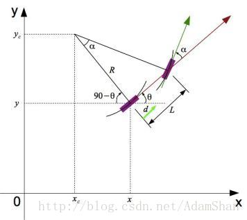
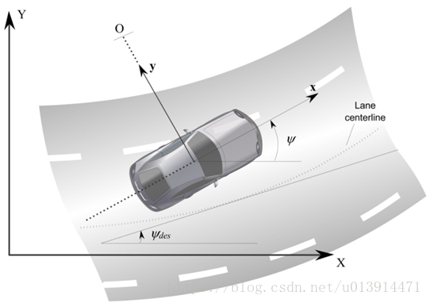
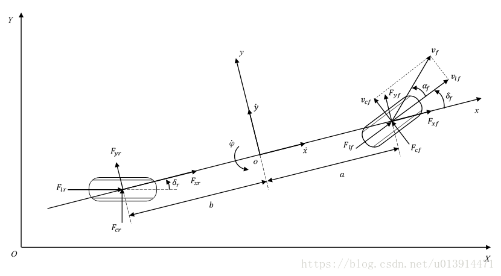
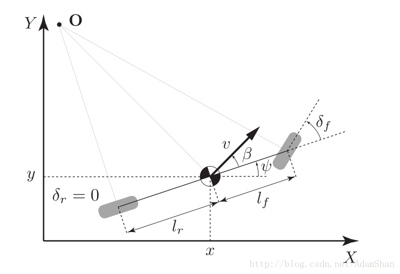
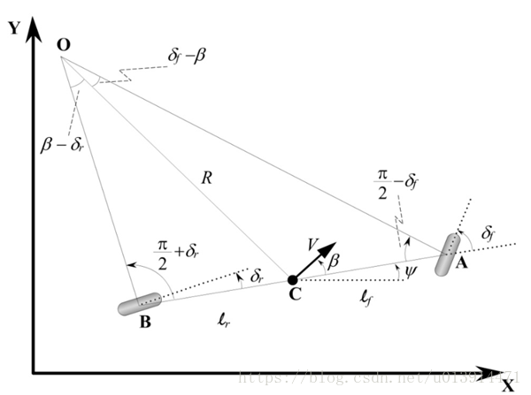
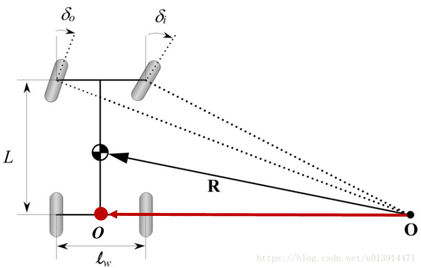
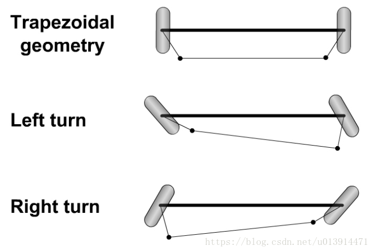
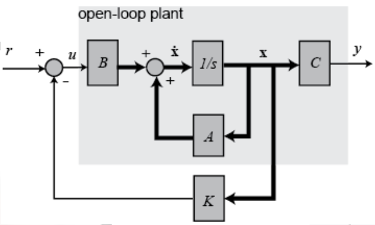
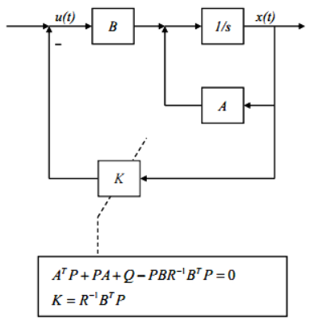
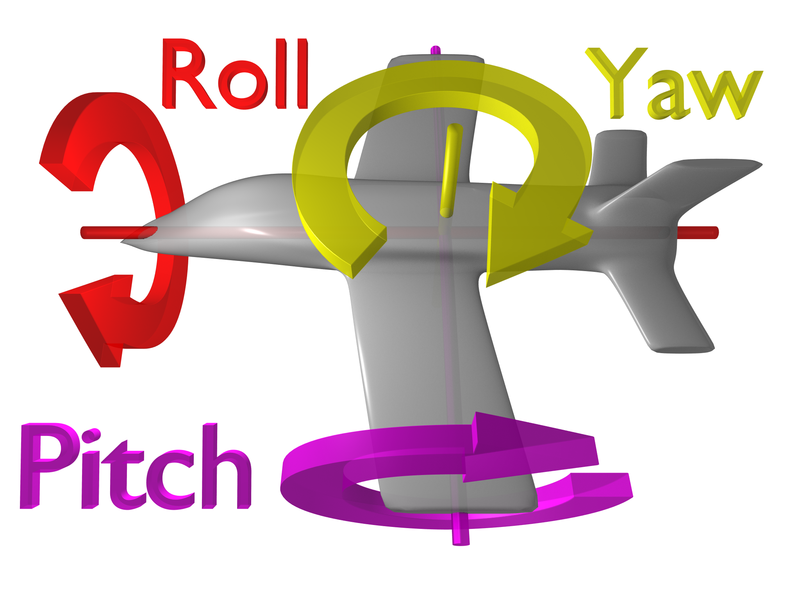

# Autopilot

- [1. 车辆模型](#1-车辆模型)
  - [1.1. 单车模型(Bicycle Model)](#11-单车模型bicycle-model)
  - [1.2. 运动学单车模型](#12-运动学单车模型)
  - [1.3. 动力学单车模型](#13-动力学单车模型)
  - [1.4. 车辆运动学模型](#14-车辆运动学模型)
  - [1.5. 车辆动力学模型](#15-车辆动力学模型)
  - [1.6. 阿克曼转向几何(Ackerman turning geometry)](#16-阿克曼转向几何ackerman-turning-geometry)
- [2. 线性二次调节器](#2-线性二次调节器)
- [3. 参考文献](#3-参考文献)

## 1. 车辆模型

- 参数定义及其关系
  |              符号              | 定义                                                                                |                                            关系                                            |
  | :----------------------------: | ----------------------------------------------------------------------------------- | :----------------------------------------------------------------------------------------: |
  |       $F_{lf}$, $F_{lr}$       | 前、后轮胎受到的纵向力                                                              |                                             -                                              |
  |       $F_{cf}$, $F_{cr}$       | 前、后轮胎受到的侧向力                                                              |                                             -                                              |
  |       $F_{xf}$, $F_{xr}$       | 前、后轮胎受到的x方向的力                                                           |                                             -                                              |
  |       $F_{yf}$, $F_{yr}$       | 前、后轮胎受到的y方向的力                                                           |     $\begin{aligned}&F_{yf}=2C_{af}\alpha_{f}\\&F_{yr}=2C_{ar}\alpha_{r}\end{aligned}$     |
  | $C_{\alpha f}$, $C_{\alpha r}$ | 分别为前后轮的侧偏刚度（cornering stiffness）                                       |                                             -                                              |
  |   $\delta_{f}$, $\delta_{r}$   | 前、后轮相对于车身正向的偏转角，也就是方向盘转角，车轮与车身正方向夹角              |                                             -                                              |
  |    $\alpha_{f}, \alpha_{r}$    | 前、后轮相对于速度方向的偏移角，这个偏转角是指轮胎当前的朝向和当前的速度方向的夹角  | $\begin{aligned}&\alpha_{f}=\delta_{f}-\theta_{vf}\\&\alpha_{r}=-\theta_{vf}\end{aligned}$ |
  |            $\beta$             | 滑移角（Tire Slip Angle），指车辆速度方向和前后轮中心连线所指的方向两者间所成的角度 |                                                                                            |
  |             $v_x$              | 纵向速度                                                                            |                                             -                                              |
  |             $I_z$              | 车辆绕 $Z$ 轴的转动惯量（$kg·m^2$）                                                 |                                             -                                              |
  |             $M_z$              | 车辆受到的横摆力偶矩（$N·m$）                                                       |                                             -                                              |
  |         $\theta_{vf}$          | 前轮速度方向角                                                                      |                                             -                                              |
  |              $a$               | 前悬长度                                                                            |                                             -                                              |
  |              $b$               | 后悬长度                                                                            |                                             -                                              |
  |              $L$               | 车辆轴长                                                                            |                                             -                                              |
  |           $l_f, l_r$           | 前、后轴中心到车辆重心的长度                                                        |                                             -                                              |
  |               m                | 车辆质量                                                                            |                                             -                                              |
  |           $m_f, m_r$           | 前、后轴中心到车辆重心的质量                                                        |           $\begin{aligned}&m_f=\frac{l_r}{L}m\\&m_f=\frac{l_f}{L}m\end{aligned}$           |
  |             $\psi$             | 航向角（Heading Angle），指车身与 $x$ 轴的夹角。                                    |                                             -                                              |
  |          $\dot{\psi}$          | 偏航角速度                                                                          |                                             -                                              |
  |         $\ddot{\psi}$          | -                                                                                   |                                             -                                              |
  |           $\ddot{y}$           | -                                                                                   |                                             -                                              |
  |              $k$               | 曲率                                                                                |                                             -                                              |
  |            $wheel$             | 前轮转角                                                                            |                                             -                                              |
  |            $steer$             | 方向盘转角                                                                          |                                             -                                              |
  |            $brake$             | 刹车                                                                                |                                             -                                              |
  |           $throttle$           | 油门                                                                                |                                             -                                              |
  |             $gear$             | 档位                                                                                |                                             -                                              |
  |              $A$               | 前轮中心                                                                            |                                             -                                              |
  |              $B$               | 后轮中心                                                                            |                                             -                                              |
  |              $C$               | 车辆质心                                                                            |                                             -                                              |
  |              $O$               | 车辆转向圆心                                                                        |                                             -                                              |
  |              $R$               | 转向半径，即圆心 $O$ 到质心 $C$ 的距离                                              |                                                                                            |

### 1.1. 单车模型(Bicycle Model)

### 1.2. 运动学单车模型

建立模型时，应尽可能使模型简单易用，且能真实反映车辆特性，搭建车辆模型多基于单车模型（Bicycle Model），使用单车模型需做如下假设：

1. 不考虑车辆在Z轴方向的运动，只考虑XY水平面的运动，如上图所示；
2. 左右侧车轮转角一致，这样可将左右侧轮胎合并为一个轮胎，以便于搭建单车模型，如下图所示；
3. 车辆行驶速度变化缓慢，忽略前后轴载荷的转移；
4. 车身及悬架系统是刚性的。

- $\delta_{r}=0$
  
  根据运动学定理，运动学单车模型中的各个状态量的更新公式如下：
  $$\begin{aligned}
    &x_{t+1}=x_{t}+v_{t}\cos(\psi_{t}+\beta)\times dt\\
    &y_{t+1}=y_{t}+v_{t}\sin(\psi_{t}+\beta)\times dt\\
    &\psi_{t+1}=\psi_{t}+\frac{v_{t}}{l_{t}}\sin(\beta)\times dt\\
    &v_{t+1}=v_{t}+\alpha\times dt  \tag{1-1}
  \end{aligned}$$
  其中$\beta$可以由如下公式计算求得：
  $$\beta=\tan^{-1}(\frac{l_{r}}{l_{f}+l_{r}}\tan{\delta_{f}}) \tag{1-2}$$

- $\delta_{r}\neq0$
  
  由正弦法则：
  $$\begin{aligned}
    &\frac{\sin(\delta_{f}-\beta)}{l_{f}}=\frac{\sin(\frac{\pi}{2}-\delta_{f})}{R}\\
    &\frac{\sin(\beta-\delta_{f})}{l_{r}}=\frac{\sin(\frac{\pi}{2}+\delta_{f})}{R} \tag{1-3}
  \end{aligned}$$
  展开上式可得：
  $$\begin{aligned}
    &\frac{\sin(\delta_{f})\cos(\beta)-\cos(\delta_{f})\sin(\beta)}{l_{f}}=\frac{\cos(\delta_{f})}{R}\\
    &\frac{\sin(\beta)\cos(\delta_{f})-\cos(\beta)\sin(\delta_{f})}{l_{r}}=\frac{\cos(\delta_{f})}{R} \tag{1-4}
  \end{aligned}$$
  联立上式可得：
  $$(\tan\delta_{f}-\tan\delta_{r})\cos\beta=\frac{l_{f}+l_{r}}{R} \tag{1-5}$$
  低速环境下，车辆行驶路径的转弯半径变化缓慢，此时我们可以假设车辆的方向变化率等于车辆的角速度。则车辆的角速度为：
  $$\dot{\psi}=\frac{V}{R}\tag{1-6}$$
  联立公式(1-5)(1-6)可得：
  $$\dot{\psi}=\frac{V\cos{\beta}}{l_{f}+l_{r}}(\tan{\delta_{f}}-\tan{\delta_{r}}) \tag{1-7}$$
  则在惯性坐标系$XY$下，可得车辆运动学模型：
  $$\begin{cases}
    \dot{X}=V\cos(\psi+\beta)\\
    \dot{Y}=V\sin(\psi+\beta)\\
    \dot{\psi}=\frac{V\cos{\beta}}{l_{f}+l_{r}}(\tan{\delta_{f}+\delta_{r}}) \tag{1-8}
  \end{cases}$$
  此模型有三个输入：$\delta_{f}$，$\delta_{r}$，$V$。其中滑移角$\beta$可由公式(1-4)求得：
  $$\beta=\tan^{-1}(\frac{l_{f}\tan{\delta_{r}}+l_{r}\tan{\delta_{f}}}{l_{f}+l_{r}}) \tag{1-9}$$

### 1.3. 动力学单车模型

### 1.4. 车辆运动学模型

### 1.5. 车辆动力学模型

### 1.6. 阿克曼转向几何(Ackerman turning geometry)

## 2. 线性二次调节器

- 开环系统
  假设有一个线性系统能用状态向量的形式表示为：
  $$\left \{\begin{array}{c}
  \dot x=Ax+Bu \\
  y=Cx+Du \tag{1}
  \end{array}\right.$$
  其中，$x(t)\in R^n$，$u(t)\in R^m$，初始条件是$x(0)$，并且假设这个系统的所有状态变量都是可测量到的。
  在介绍LQR前，先简单回顾一下现代控制理论中最基本的控制器——全状态反馈控制。
- 闭环系统
  全状态反馈控制系统图形如下：
  
  状态方程：
  $$\left \{\begin{array}{c}
  \dot{x}=Ax+Bu \\
  y=Cx+Du \tag{2}
  \end{array}\right.$$
  我们要设计一个状态反馈控制器：$$u=-Kx \tag{3}$$ 使得闭环系统能够满足我们期望的性能。我们把这种控制代入之前的系统状态方程得到：
  $$\dot x=Ax-BKx=(A-BK)x=A_{c}x \tag{4}$$
  其中，$x(t)\in R^n$，$u(t)\in R^m$，初始条件是$x(0)$，并且假设这个系统的所有状态变量都是可测量到的。
  对于开环系统，由现代控制理论我们知道，开环传递函数的极点就是系统矩阵A的特征值（传递函数的分母是$|sI-A|$，$|\cdot|$表示行列式）。
  现在变成了闭环形式，状态变换矩阵$A$变成了$(A-BK)$。因此通过配置反馈矩阵$K$，可以使得闭环系统的极点达到我们期望的状态。注意，这种控制器的设计与输出矩阵$C$，$D$没有关系。
  那么，什么样的极点会使得系统性能很棒呢？并且，当系统变量很多的时候，即使设计好了极点，矩阵K也不好计算。
  于是，LQR为我们设计最优控制器提供了一种思路。在设计LQR控制器前，我们得设计一个能量函数，最优的控制轨迹应该使得该能量函数最小。一般选取如下形式的能量函数：
  $$J=\frac{1}{2}\int_{0}^{\infty}(x^{T}Qx+u^{T}Ru)dt \tag{5}$$
  其中，$Q$是你自己设计的半正定矩阵，$R$为正定矩阵。
  可是，为什么能量函数（或称系统的目标函数）得设计成这个样子呢？
  首先假设状态向量$x(t)$是1维的，那么其实就是一个平方项$Qx^2 \ge 0$，同理，能量函数$J$要最小，那么状态向量$x(t)$，$u(t)$都得小。$J$最小，那肯定是个有界的函数，我们能推断当$t$趋于无穷时，状态向量$x(t)$将趋于0，即$lim_{t\to{\infty}}x(t)=0$，这也保证了闭环系统的稳定性。那输入$u(t)$要小是什么意思呢？它意味着我们用最小的控制代价得到最优的控制。譬如控制电机，输入PWM小，将节省能量。
  再来看看矩阵$Q$、$R$的选取。一般来说，$Q$值选得大意味着，要使得$J$小，那$x(t)$需要更小，也就是意味着闭环系统的矩阵$(A-BK)$的特征值处于S平面左边更远的地方，这样状态$x(t)$就以更快的速度衰减到0。另一方面，大的$R$表示更加关注输入变量$u(t)$，$R$值选得大意味着，要使得$J$小，那$u(t)$需要更小，$u(t)$的减小，意味着状态衰减将变慢。同时，$Q$为半正定矩阵意味着他的特征值非负，$R$为正定矩阵意味着它的特征值为正数。如果你选择的$Q$、$R$都是对角矩阵的话，那么$Q$的对角元素为正数，允许出现几个0元素，而$R$的对角元素只能是正数。
  注意LQR调节器是将状态调节到0，这与轨迹跟踪不同，轨迹跟踪是使得系统误差为0。
  知道了背景后，那如何设计反馈矩阵$K$使得能量函数$J$最小呢？很多地方都是从最大值原理，Hamilton函数推导出来，这里用另外一种更容易接受的方式推导。
  将 $u=-Kx$ 代入之前的能量函数得到：
  $$\begin{aligned}
  J&=\frac{1}{2}\int_{0}^{\infty} (x^{T}Qx+u^{T}Ru) dt \\
   &=\frac{1}{2}\int_{0}^{\infty} (x^{T}Qx+x^{T}K^{T}RKx) dt \\
   &=\frac{1}{2}\int_{0}^{\infty} x^{T}(Q+K^{T}RK)x dt \tag{6}
  \end{aligned}$$
  为了找到 $K$，我们先不防假设存在一个常量矩阵P使得：
  $$\begin{aligned}
  \frac{d}{dt}(x^{T}Px)&=\dot{x}^{T}Px+x^{T}P\dot{x} \\
                       &=x^{T}A_{c}^{T}Px+x^{T}PA_{c}x \\
                       &= x^{T}(A_{c}^{T}P+PA_{c})x \\
                       &=-x^{T}(Q+K^{T}RK)x \tag{7}
  \end{aligned}$$
  代入(6)式得：
  $$J=-\frac{1}{2}\int_{0}^{\infty}\frac{d}{dt}(x^{T}Px) dt=\frac{1}{2}x^{T}(0)Px(0) \tag{8}$$
  由于我们已经假设闭环系统是稳定的，也就是$t$趋于无穷时，$x(t)$ 趋于0。
  由(7)得：
  $$ x^{T} (A_{c}^{T}P+PA_{c}+Q+K^{T}RK) x=0 \tag{9} $$
  这个式子要始终成立的话，括号里的项必须恒等于0。即：
  $$\begin{aligned}
  &A_{c}^{T}P+PA_{c}+Q+K^{T}RK=0 \\
  &(A-BK)^{T}P+P(A-BK)+Q+K^{T}RK=0 \\
  &A^{T}P-K^{T}B^{T}P+PA-PBK+Q+K^{T}RK=0 \\
  &A^{T}P+PA+Q+K^{T}RK-K^{T}B^{T}P-PBK=0 \tag{10}
  \end{aligned}$$
  这是一个关于K的二次型等式，当然这个二次型是我们不愿看到的，因为计算复杂。现在只要这个等式成立，我们何必不选择$K$使得两个二次项正好约掉了呢？这样既符合了要求，又简化了计算。
  取 $K=R^{-1}B^{T}P$，代入上式得：
  $$\begin{aligned}
  &A^{T}P+PA+Q+(R^{-1}B^{T}P)^{T}R(R^{-1}B^{T}P)-(R^{-1}B^{T}P)^{T}B^{T}P-PB(R^{-1}B^{T}P)=0 \\
  &A^{T}P+PA+Q-PBR^{-1}B^{T}P=0 \tag{11}
  \end{aligned}$$
  $K$ 的二次项没有了，可 $K$ 的取值和 $P$ 有关，而 $P$ 是我们假设的一个量，$P$ 只要使得的(11)式成立就行了。而(11)式在现代控制理论中极其重要，它就是有名的 Riccati 方程。
  现在回过头总结下LQR控制器是怎么计算反馈矩阵K的：
  1. 选择参数矩阵 $Q$，$R$；
  2. 求解 Riccati 方程得到矩阵$P$；
  3. 计算 $K=R^{-1}B^{T}P$。
- LQR的结构图：
  

- Pitch Yaw Roll
  在航空中，Pitch，Yaw，Roll 如下图所示。
  Pitch 是围绕X轴旋转，也叫俯仰角；
  Yaw 是围绕Y轴旋转，也叫偏航角；
  Roll 是围绕Z轴旋转，也叫翻滚角。
  

## 3. 参考文献

- [LQR](https://blog.csdn.net/datase/article/details/78487126)
- [Apollo控制算法之汽车动力学模型和LQR控制](https://www.cnblogs.com/mohuishou-love/p/10475029.html)
- [LQR 的直观推导及简单应用](https://blog.csdn.net/heyijia0327/article/details/39270597)
- [无人驾驶汽车系统入门（五）——运动学自行车模型和动力学自行车模型](https://blog.csdn.net/AdamShan/article/details/78696874)
- [Apollo代码学习(二)—车辆运动学模型](https://blog.csdn.net/u013914471/article/details/82968608)
- [Apollo代码学习(三)—车辆动力学模型](https://blog.csdn.net/u013914471/article/details/83018664)
- [Apollo控制算法中使用的车辆动力学模型的推导过程](http://www.elecfans.com/d/875759.html)
