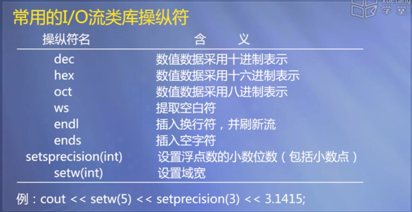
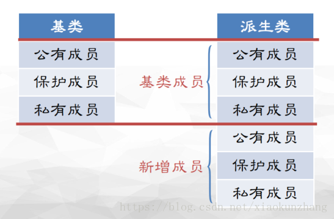
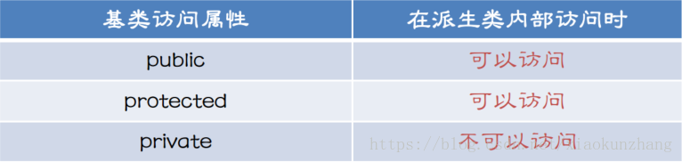
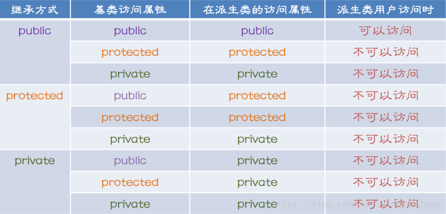
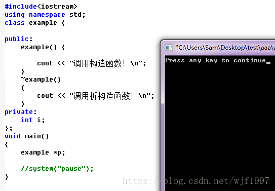
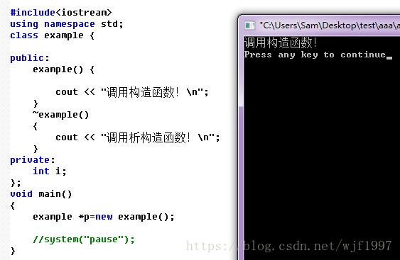
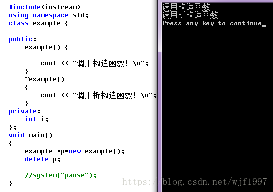
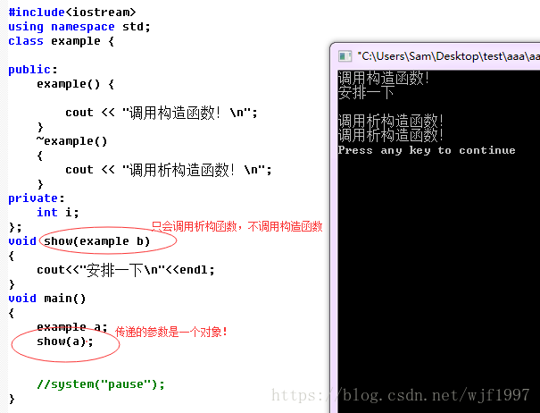
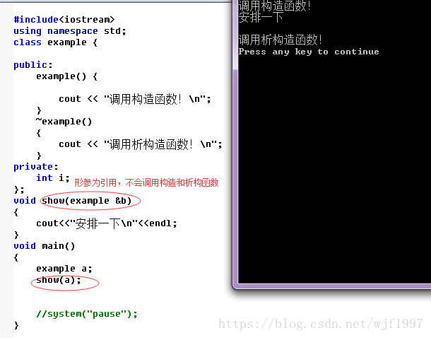

# c++

- [类型转换](#类型转换)
- [常用的 I/O 流类库操作符](#常用的-io-流类库操作符)
- [基类与派生类](#基类与派生类)
- [关键字](#关键字)
  - [const](#const)
  - [static](#static)
  - [final](#final)
  - [override](#override)
- [构造函数和析构函数](#构造函数和析构函数)
- [函数模板与类模板](#函数模板与类模板)
- [异常处理](#异常处理)
- [参考文献](#参考文献)

## 类型转换

语法形式：
类型说明符(表达式)
(类型说明符)表达式
类型操作符<类型说明符>(表达式) —— C++特有形式

类型操作符可以是：
const_cast、dynamci_cast、static_cast
例：`int(z)`、`(int)z`、`static_cast<int>(z)` 三种完全等价。

## 常用的 I/O 流类库操作符



## 基类与派生类

- 单个类中的访问权限：
  - public（公有成员）：在类的内部和外部都可以直接访问；
  - protect（保护成员）：在本类的内部和派生类的内部可以直接访问，外部均不可以直接访问，外部只能通过成员函数或友元函数进行访问；
  - private（私有成员）：在类的内部可以直接访问，外部不可以直接访问，外部只能通过成员函数或友元函数进行访问。

- 继承方式：
  - public：基类中的成员访问权限在派生类中不变；
  - protect：基类中的 public 成员在派生类中变为 protect 成员，其它不变；
  - private：基类中的所有成员在派生类中均变为 private 成员。

- 派生类的构成
  - 派生类拥有基类所有的数据成员和成员函数；
  - 派生类可以拥有基类没有的数据成员和成员函数；
  - 可以通过访问说明符控制成员的访问权限；
  - 派生类是一种特殊的基类， 可以将派生类对象当作父类对象使用；
  - 友元函数不能被继承， 友元函数不是成员函数。
  - 可以通过在派生类中声明同名的成员， 来实现修改基类成员功能的效果。

  

- 访问属性设置的原则：
  - 需要被外界访问的成员，设置为：public；
  - 只能在当前类中访问的成员， 设置为：private；
  - 只能在当前类和派生类中访问的成员，设置为：protected。

  

  

## 关键字

### const

const 是 constant 的缩写，“恒定不变”的意思。被 const 修饰的东西都受到强制保护，可以预防意外的变动，能提高程序的健壮性。所以很多 C++程序设计书籍建议：“Use const whenever you need”。s

如果参数作输出用，不论它是什么数据类型，也不论它采用“指针传递”还是“引用传递”，都不能加 const 修饰，否则该参数将失去输出功能。const 只能修饰输入参数，如果输入参数采用“指针传递”，那么加 const 修饰可以防止意外地改动该指针，起到保护作用。

- 函数返回值不可作为左值。在“指针传递”和“引用传递”时可以加`const`修饰，但是在“值传递”的情况下，由于函数将自动产生临时变量用于复制该参数，该输入参数本来就无需保护，所以不要加`const`修饰。

  ```cpp
  const int *fun(int *xxx) {}
  const int &fun(int &xxx) {}
  ```

- 形参在本函数内不能作为左值。

  ```cpp
  int *fun(const int *xxx) {}
  int &fun(const int &xxx) {}
  int fun(const int xxx) {}
  ```

- 任何不会修改数据成员的函数都应该声明为 const 类型。此种写法表示本函数不会修改本对象中的成员变量。

  ```cpp
  int* fun(int* xxx) const {}
  ```

### static

...

### final

...

### override

...

## 构造函数和析构函数

在我们创建新的对象的时候，都要执行某一个类中的构造函数，而当调用构造函数分配了资源之后，当我们销毁一个对象的时候需要一个相应的操作将这些资源释放出去，这就需要析构函数。一般来说，在有基类和派生类存在时，在创建派生类类型时，会先构造基类，再构造派生类，析构顺序反之，类似于进栈出栈的过程。

指针不会调用构造和析构函数：



当对指针用 new 在内存中开辟空间的时候会调用构造函数：



当我们使用 new 为指针开辟空间，然后用 delete 释放掉空间会调用构造和析构函数：



当我们函数的形参是一个对象的时候，这时候会系统只会调用析构函数，而缺少形参的构造函数：



当形参为一个对象的时候，实参也为对象，这时候系统会将实参复制一份给形参，此时系统就不会再给形参额外调用构造函数来对形参对象初始化了，所以就不会调用构造函数，但是形参被销毁的时候还是会调用析构函数！

当我们函数的形参是一个引用的时候，这时候会系统不调用构造函数和析构函数：



当形参为一个引用的时候，实参也对象，这时候系统会将形参指向实参，此时系统就不会对形参调用构造函数和析构函数！

构造函数存在的目的就是为了给对象在内存中开辟空间并且给对象设置一些初始值，而析构函数就是将某个对象从内存中抹除，而设置的，经典的例子就是上边的指针的例子。

## 函数模板与类模板

...

## 异常处理

...

## 参考文献

- [const 的用法](https://blog.csdn.net/weixin_39345003/article/details/81276968?utm_medium=distribute.pc_relevant_t0.none-task-blog-BlogCommendFromMachineLearnPai2-1.edu_weight&depth_1-utm_source=distribute.pc_relevant_t0.none-task-blog-BlogCommendFromMachineLearnPai2-1.edu_weight)
- [C++何时调用构造函数，何时调用析构函数](https://blog.csdn.net/wjf1997/article/details/83041666)
- [派生类的定义、构成及访问控制](https://blog.csdn.net/xiaokunzhang/article/details/80997274)
