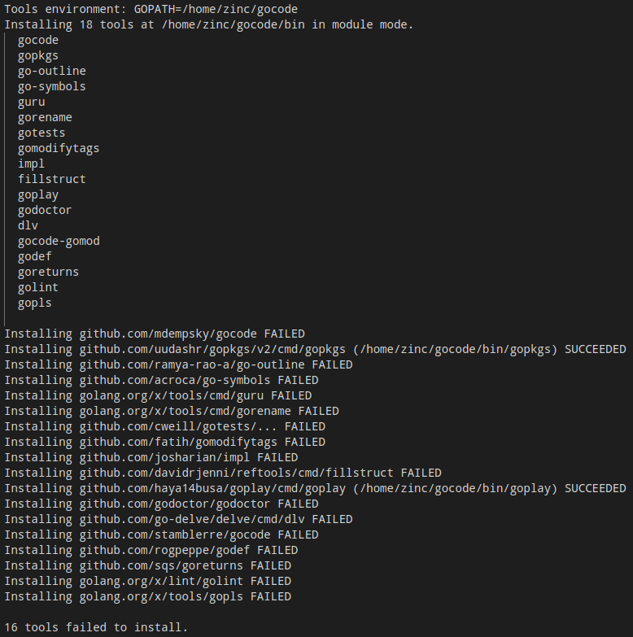

# Go

- [Configure](#configure)
  - [vscode+go](#vscodego)
  - [goland](#goland)
- [Reference](#reference)

## Configure

### vscode+go

1. 安装工程相关依赖

   ```bash
   sudo apt build-dep startdde dde-daemon
   sudo apt install golang-go
   ```

2. 配置 go 的环境变量

   - 下载 go 的官网

     Go 官网下载地址：<https://golang.org/dl/>

     Go 官方镜像站（推荐）：<https://golang.google.cn/dl/>

   - 修改 `/etc/profile` 或 `~/.bashrc` 文件

     ```bash
     export GOROOT=/usr/bin/go:/usr/local/go        # go 安装路径，可选
     export GOPATH=/usr/share/gocode:$HOME/gocode   # Tools environment 这里存放的是安装的依赖包，必选
     export PATH=$PATH:$GOROOT/bin                  # 添加 go 可执行文件路径到环境变量中，必选
     export GOPROXY=https://goproxy.cn,direct       # 添加代理，可选
     export GOPRIVATE=pkg.deepin.com                # 添加仓库，必选
     ```

   - 或者直接执行下列命令

     ```bash
     sudo echo "export GOROOT=/usr/bin/go:/usr/local/go" >> ~/.bashrc       # 可选
     sudo echo "export GOPATH=/usr/share/gocode:$HOME/gocode" >> ~/.bashrc  # 必选
     sudo echo "export PATH=$PATH:$GOROOT/bin" >> ~/.bashrc                 # 必选
     sudo echo "export GOPROXY=https://goproxy.cn,direct" >> ~/.bashrc      # 可选
     sudo echo "export GOPRIVATE=pkg.deepin.com" >> ~/.bashrc               # 必选
     ```

   > 这一步做完已经可以用 `make` 编译了。可以用 `debuild -b -us -uc -tc` 编译生成 deb 包安装系统中测试。
   > 上面标注“可选”的环境变量，非必要情况下，不要设置。

3. 安装 vscode 中 go 相关的依赖工具

   当用 vscode 打开 go 的工程时，它会在右下角提示安装工具包，点击”Install All“后，vscode 就自动开始安装了，总共就是下列图中的 18 个工具包，安装过程可能耗时较长。第一遍可能会有安装成功的，只用特殊处理那些没安装成功的就可以了。在最下面会有报错信息，大致描述了失败的原因，但是大多也就是仓库拉取失败，导致无法安装。如果觉得报错信息不够清晰，可以用下面的 `go install xxx` 命令试一下，报错的信息会非常详细，基本上就能看出到底因为啥了。

   

   ```bash
   # 下面列出的是那18个工具包
   gocode
   gopkgs
   go-outline
   go-symbols
   guru
   gorename
   gotests
   gomodifytags
   impl
   fillstruct
   goplay
   godoctor
   dlv
   gocode-gomod
   godef
   goreturns
   golint
   gopls
   ```

   ```bash
   # 在安装前，需要在 $GOPATH 路径下创建对应工具包的目录，并拉取代码仓库
   # gocode
   cd $GOPATH
   mkdir -p src/github.com/mdempsky
   cd src/github.com/mdempsky
   git clone git@github.com:mdempsky/gocode.git
   # gopkgs
   cd $GOPATH
   mkdir -p src/github.com/uudashr
   cd src/github.com/uudashr
   git clone git@github.com:uudashr/gopkgs.git
   # go-outline
   cd $GOPATH
   mkdir -p src/github.com/ramya-rao-a
   cd src/github.com/ramya-rao-a
   git clone git@github.com:ramya-rao-a/go-outline.git
   # go-symbols
   cd $GOPATH
   mkdir -p src/github.com/acroca
   cd src/github.com/acroca
   git clone git@github.com:acroca/go-symbols.git
   # gotests
   cd $GOPATH
   mkdir -p src/github.com/cweill
   cd src/github.com/cweill
   git clone git@github.com:cweill/gotests.git
   # gomodifytags
   cd $GOPATH
   mkdir -p src/github.com/fatih
   cd src/github.com/fatih
   git clone git@github.com:fatih/gomodifytags.git
   # impl
   cd $GOPATH
   mkdir -p src/github.com/josharian
   cd src/github.com/josharian
   git clone git@github.com:josharian/impl.git
   # reftools
   cd $GOPATH
   mkdir -p src/github.com/davidrjenni
   cd src/github.com/davidrjenni
   git clone git@github.com:davidrjenni/reftools.git
   # goplay
   cd $GOPATH
   mkdir -p src/github.com/haya14busa
   cd src/github.com/haya14busa
   git clone git@github.com:haya14busa/goplay.git
   # godoctor
   cd $GOPATH
   mkdir -p src/github.com/godoctor
   cd src/github.com/godoctor
   git clone git@github.com:godoctor/godoctor.git
   # delve
   cd $GOPATH
   mkdir -p src/github.com/go-delve
   cd src/github.com/go-delve
   git clone git@github.com:go-delve/delve.git
   # gocode
   cd $GOPATH
   mkdir -p src/github.com/stamblerre
   cd src/github.com/stamblerre
   git clone git@github.com:stamblerre/gocode.git
   # godef
   cd $GOPATH
   mkdir -p src/github.com/rogpeppe
   cd src/github.com/rogpeppe
   git clone git@github.com:rogpeppe/godef.git
   # goreturns
   cd $GOPATH
   mkdir -p src/github.com/sqs
   cd src/github.com/sqs
   git clone git@github.com:sqs/goreturns.git
   # golang.org/x
   cd $GOPATH
   mkdir -p src/golang.org/x
   cd src/golang.org/x
   git clone git@github.com:golang/tools.git
   git clone git@github.com:golang/mod.git
   git clone git@github.com:golang/lint.git
   git clone git@github.com:golang/xerrors.git
   git clone git@github.com:golang/sync.git
   # godirwalk
   cd $GOPATH
   mkdir -p src/github.com/karrick
   cd src/github.com/karrick
   git clone git@github.com:karrick/godirwalk.git
   # errors
   cd $GOPATH
   mkdir -p src/github.com/pkg
   cd src/github.com/pkg
   git clone git@github.com:pkg/errors.git
   # camelcase
   cd $GOPATH
   mkdir -p src/github.com/fatih
   cd src/github.com/fatih
   git clone git@github.com:fatih/camelcase.git
   git clone git@github.com:fatih/structtag.git
   # open-golang
   cd $GOPATH
   mkdir -p src/github.com/skratchdot
   cd src/github.com/skratchdot
   git clone git@github.com:skratchdot/open-golang.git
   # go-diff
   cd $GOPATH
   mkdir -p src/github.com/sergi
   cd src/github.com/sergi
   git clone git@github.com:sergi/go-diff.git
   # go-cmp
   cd $GOPATH
   mkdir -p src/github.com/google
   cd src/github.com/google
   git clone git@github.com:google/go-cmp.git
   # mvdan.cc
   cd $GOPATH
   mkdir -p src/mvdan.cc
   cd src/mvdan.cc
   git clone git@github.com:mvdan/gofumpt.git
   git clone git@github.com:mvdan/xurls.git
   # honnef.co/go/tools
   cd $GOPATH
   mkdir -p src/honnef.co/go
   cd src/honnef.co/go
   git clone git@github.com:dominikh/go-tools.git tools
   # toml
   cd $GOPATH
   mkdir -p src/github.com/BurntSushi
   cd src/github.com/BurntSushi
   git clone git@github.com:BurntSushi/toml.git
   ```

   ```bash
   # 安装工具包
   cd $GOPATH
   go install github.com/mdempsky/gocode                      # SUCCEEDED
   go install github.com/uudashr/gopkgs/v2/cmd/gopkgs         # SUCCEEDED
   go install github.com/ramya-rao-a/go-outline               # SUCCEEDED
   go install github.com/acroca/go-symbols                    # SUCCEEDED
   go install golang.org/x/tools/cmd/guru                     # ERROR
   go install golang.org/x/tools/cmd/gorename                 # SUCCEEDED
   go install github.com/cweill/gotests/...                   # SUCCEEDED
   go install github.com/fatih/gomodifytags                   # ERROR
   go install github.com/josharian/impl                       # SUCCEEDED
   go install github.com/davidrjenni/reftools/cmd/fillstruct  # SUCCEEDED
   go install github.com/haya14busa/goplay/cmd/goplay         # SUCCEEDED
   go install github.com/godoctor/godoctor                    # SUCCEEDED
   go install github.com/go-delve/delve/cmd/dlv               # ERROR
   go install github.com/stamblerre/gocode                    # SUCCEEDED
   go install github.com/rogpeppe/godef                       # SUCCEEDED
   go install github.com/sqs/goreturns                        # SUCCEEDED
   go install golang.org/x/lint/golint                        # SUCCEEDED
   go install golang.org/x/tools/gopls                        # ERROR
   ```

   > 在安装前，建议将 `$GOPATH` 仅设置为 `$HOME/gocode`，因为加上 `/usr/share/gocode` 后安装时会提示权限问题。
   > 当所有的工具安装完成后，再将整个 `$HOME/gocode` 复制到 `/usr/share/gocode` 下。
   > 如果执行上述命令的时候提示找不到包，有两种可能性：一种是它拉取代码的仓库错了，可以直接去 github 上搜那个缺失的工具包名，按照报错的路径将拉下来代码放在那里，然后再执行上述命令。第二种就是单纯的路径错了，按照提示的，将代码放在正确的路径就好了。
   > 上述工具包安装过程中可能会提示 `undefined: strings.ReplaceAll` 等类似问题，这属于 go 的版本升级过程中的问题，不过问题不大，暂时先忽略。

### goland

前两步与 vscode 配置相同，然后安装 goland 就可以了。

goland 官网下载地址：<https://www.jetbrains.com/go/>

## Reference

- [从零开始搭建 Go 语言开发环境](https://www.liwenzhou.com/posts/Go/install_go_dev/)
- [5 分钟无脑搭建桌面后端环境](https://wikidev.uniontech.com/index.php?title=5%E5%88%86%E9%92%9F%E6%97%A0%E8%84%91%E6%90%AD%E5%BB%BA%E6%A1%8C%E9%9D%A2%E5%90%8E%E7%AB%AF%E7%8E%AF%E5%A2%83)
- [后端开发环境配置 - VSCode](https://wikidev.uniontech.com/index.php?title=%E5%90%8E%E7%AB%AF%E5%BC%80%E5%8F%91%E7%8E%AF%E5%A2%83%E9%85%8D%E7%BD%AE_-_VSCode)
- [后端开发环境配置](https://wikidev.uniontech.com/index.php?title=%E5%90%8E%E7%AB%AF%E5%BC%80%E5%8F%91%E7%8E%AF%E5%A2%83%E9%85%8D%E7%BD%AE)
- [golang undefined: strings.ReplaceAll 解决](https://blog.csdn.net/vah101/article/details/102615415)
- [Crack JetBrains](https://macwk.com/article/jetbrains-crack)
