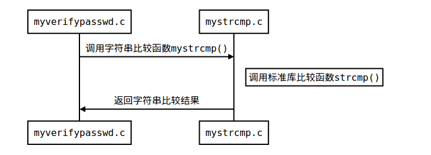
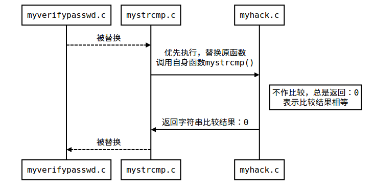
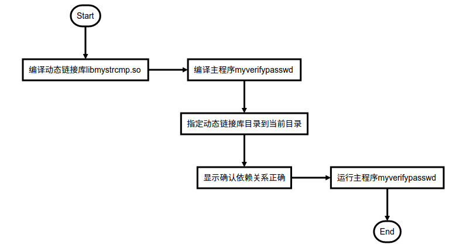

# LD_PRELOAD

- [1 概述](#1-概述)
- [2 程序调用流图](#2-程序调用流图)
- [3 演示程序代码](#3-演示程序代码)
- [4 程序编译与试验](#4-程序编译与试验)
- [5 Reference](#5-reference)

## 1 概述

LD_PRELOAD 是 Linux 系统的一个环境变量，它可以影响程序的运行时的链接（Runtime linker），它允许你定义在程序运行前优先加载的动态链接库。这个功能主要就是用来有选择性的载入不同动态链接库中的相同函数。通过这个环境变量，我们可以在主程序和其动态链接库的中间加载别的动态链接库，甚至覆盖正常的函数库。一方面，我们可以以此功能来使用自己的或是更好的函数（无需别人的源码），而另一方面，我们也可以以向别人的程序注入程序，从而达到特定的目的。

## 2 程序调用流图

- LA_PRELOAD 替换前

  

- LA_PRELOAD 替换后

  

## 3 演示程序代码

- 主程序

```cpp
// myverifypasswd.c
#include <stdio.h>
#include <string.h>
#include "mystrcmp.h"

void main(int argc, char **argv)
{
    char passwd[] = "password";
    if (argc < 2)
    {
        printf("usage: %s <password>\n", argv[0]);
        return;
    }
    if (!mystrcmp(passwd, argv[1]))
    {
        printf("Correct Password!\n");
        return;
    }
    printf("Invalid Password!\n");
}
```

- 调用库

```cpp
// mystrcmp.h
#include <stdio.h>
int mystrcmp(const char *s1, const char *s2);
```

```cpp
// mystrcmp.c
#include <stdio.h>
#include <string.h>
#include "mystrcmp.h"

int mystrcmp(const char *s1, const char *s2)
{
    return strcmp(s1, s2); //正常字串比较
}
```

## 4 程序编译与试验

- 演示流程图

  

- 编译、设置指令

  ```bash
  gcc mystrcmp.c -fPIC -shared -o libmystrcmp.so        # 编译动态链接库
  gcc myverifypasswd.c -L. -lmystrcmp -o myverifypasswd # 编译主程序
  export LD_LIBRARY_PATH=/home/n6/Desktop/LD_PRELOAD    # 指定动态链接库所在目录位置
  ldd myverifypasswd                                    # 显示、确认依赖关系
  ./myverifypasswd                                      # 运行主程序myverifypasswd
  ```

- 终端运行结果

  ```bash
  n6@X240s:~/桌面/LD_PRELOAD$ gcc mystrcmp.c -fPIC -shared -o libmystrcmp.so
  n6@X240s:~/桌面/LD_PRELOAD$ gcc myverifypasswd.c -L. -lmystrcmp -o myverifypasswd
  n6@X240s:~/桌面/LD_PRELOAD$ export LD_LIBRARY_PATH=/home/n6/桌面/LD_PRELOAD
  n6@X240s:~/桌面/LD_PRELOAD$ ldd myverifypasswd
    linux-vdso.so.1 =>  (0x00007ffedc1bd000)
    libmystrcmp.so => /home/n6/桌面/LD_PRELOAD/libmystrcmp.so (0x00007eff99a7f000)
    libc.so.6 => /lib/x86_64-linux-gnu/libc.so.6 (0x00007eff99698000)
    /lib64/ld-linux-x86-64.so.2 (0x000056269aba4000)

  n6@X240s:~/桌面/LD_PRELOAD$ ./myverifypasswd
  usage: ./myverifypasswd <password>
  n6@X240s:~/桌面/LD_PRELOAD$ ./myverifypasswd abc
  Invalid Password!
  n6@X240s:~/桌面/LD_PRELOAD\$ ./myverifypasswd password
  Correct Password!
  ```

## 5 Reference

- [LD_PRELOAD 的偷梁换柱之能](https://www.cnblogs.com/net66/p/5609026.html)
- [Linux 共享库 LD_PRELOAD 环境变量](https://blog.csdn.net/htf15/article/details/8689973)
- [警惕 UNIX 下的 LD_PRELOAD 环境变量](https://blog.csdn.net/haoel/article/details/1602108)
