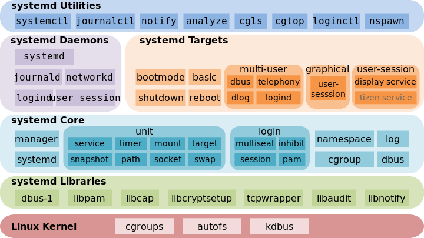

# Systemd

- [1. 简介](#1-简介)
- [2. 争议](#2-争议)
- [3. 概述](#3-概述)
- [4. 系统管理](#4-系统管理)
  - [4.1 systemd-analyze](#41-systemd-analyze)
  - [4.2 hostnamectl](#42-hostnamectl)
  - [4.3 localectl](#43-localectl)
  - [4.4 timedatectl](#44-timedatectl)
  - [4.5 loginctl](#45-loginctl)
- [5. Unit](#5-unit)
  - [5.1 Unit 种类](#51-unit-种类)
  - [5.2 Unit 状态](#52-unit-状态)
  - [5.3 Unit 管理](#53-unit-管理)
  - [5.4 依赖关系](#54-依赖关系)
  - [5.5 Unit 的配置文件](#55-unit-的配置文件)
- [6. Tatget](#6-tatget)
- [7. 日志管理](#7-日志管理)
- [8. 参考文献](#8-参考文献)

## 1. 简介

systemd 是 Linux 系统的一组基本构建块。它提供了一个以 PID 1 运行的系统和服务管理器，并启动了系统的其余部分。systemd 提供积极的并行化功能，使用套接字和 D-Bus 激活来启动服务，按需启动守护程序，使用 Linux 控制组跟踪进程，维护安装和自动挂载点以及实现精心设计的基于事务依赖关系的服务控制逻辑。systemd 支持 SysV 和 LSB 初始化脚本，并替代 sysvinit。其他部分包括日志记录守护程序，用于控制基本系统配置的实用程序，例如主机名，日期，区域设置，维护已登录用户和正在运行的容器和虚拟机的列表，系统帐户，运行时目录和设置，以及用于管理简单网络的守护程序配置，网络时间同步，日志转发和名称解析。

Systemd 是 Linux 系统工具，用来启动守护进程，目前已成为大多数发行版的标准配置。但在历史上，Linux 的启动一直采用 init 进程，用下面的命令启动服务：

```bash
sudo /etc/init.d/apache2 start
service apache2 start
```

这种方法有两个缺点：

- 一是启动时间长。init 进程是串行启动，只有前一个进程启动完，才会启动下一个进程。
- 二是启动脚本复杂。init 进程只是执行启动脚本，不管其他事情，脚本需要自己处理各种情况，这往往使得脚本变得很长。

## 2. 争议

- 优势
  1. 手册文档详细。
  2. 统一用`/etc/os-release`文件区分各个 Linux 发行版。
  3. systemd 本来是一个先进的 init 程序，除了管理 daemon 之外，还实现了 socket-activation 来支持按需加载服务。就架构上来说完胜现有的任何系统上的任何服务管理体系。
  4. 启动速度相比与其他 init 程序，会稍快一些。
  5. 迭代迅速，新功能增加很快。

- 争议点
  1. 不遵循 UNIX 原则。UNIX 的哲学是做一件事，并且把它做好，而 systemd 则是把 pid 1 扩张到最大化。
  2. systemd 在设计之初就不考虑 Linux 以外的平台，不遵循 POSIX 标准，而且很多功能根本就是 Linux 特有的，无法移植到 Linux 之外的平台，这尤其让 BSD 爱好者们很受伤，在 Debian 7 以前，一直维护着 Linux 和 FreeBSD 两个内核，只不过后者没什么人用，Debian 8 为了支持 systemd 不得不放弃支持 Debian kFreeBSD。
  3. 接管了太多设施，如 syslog 被 systemd-journal 取代，crond 也被 systemd 的 timer 单元取代，udev 也准备集成到 systemd 中来，未来甚至还可能取代 /etc/fstab。尽管这些新的服务大部分都是独立于主进程的，但是还是有整个系统被红帽控制住的感觉（systemd 的作者 Lennart Poettering 就职于红帽，systemd 也主要是红帽的 Fedora 首先在推，OpenSUSE 后面跟随）。这在开源社区看来是件政治不正确的事情。
  4. 有人怀疑 systemd 的可靠程度，然后就是很多管理员以前积攒的脚本全报废了（这也是管理员反对的主因吧）。
  5. systemd 的作者是 Lennart Poettering，其主要的三个项目是 avahi, PulseAudio, systemd。他和他的小伙伴有这样的特点
     - 生产力极高。systemd 以不可思议的速度刷版本号，而且每次更新都有新功能。Linux 的核心服务大部分都很有年头了，systemd 的开发节奏和它们反差甚大。
     - 代码质量不高。PulseAudio 和 systemd 初期都有巨量的 bug，经过很长时间才达到稳定。对于 systemd 这显然不符合人们的期望。Init 应该由 Linus 这样的靠谱程序员而不是 Poettering 这种傻逼程序员负责。
     - 频繁变更设计和接口。systemd 的新功能，最好都等几个版本再用。因为 Poettering 似乎是喜欢让用户的实践去打磨他的设计的。
     - 不考虑向后兼容。Poettering 和小伙伴们有着极端的“只用正确的方法做事”的态度。如果某个用法过去可以工作，但不符合他们心目中“正确的方式”，他们会在新版本中毫不犹豫地将你 break 掉。这种态度屡次遭到 Linus 痛骂（由于 udev 和内核紧密集成）。很多人不喜欢这种以飞速不断生产 bug 和不成熟设计的风格。实际上这更接近商业软件公司（比如微软）的开发风格，而这显然也会招黑。
  6. systemd 极端地奉行“只考虑 Linux”，不接受任何改进非 Linux 系统兼容性的 patch。由于 systemd 项目合并了 udev, logind 等基础设施，以及 Gnome/KDE 积极与 systemd 集成，这给其它开源内核的桌面用户（以及 Debian 这样的多内核发行版）造成了困扰。
  7. 对比 sysvinit，系统管理员不喜欢 systemd：
     - systemd 是用 C 而不是系统管理员熟悉的 shell 写成。
     - systemd 的核心是单个 binary，而不是一堆脚本和小程序拼凑而成，不符合所谓 The Unix Way。
     - 喜欢重新发明轮子。systemd 重新发明了一堆历史悠久的核心服务（通常是简化功能和配置）：syslog, ntp, cron, fstab, dhcpcd, vt... 系统管理员更信赖他们熟悉的服务（尽管配置较为复杂）。而重新发明轮子总体上在开源社区是不被赞许的。

## 3. 概述

Systemd 就是的设计目标是，为系统的启动和管理提供一套完整的解决方案。根据 Linux 惯例，字母 d 是守护进程（daemon）的缩写。 Systemd 这个名字的含义，就是它要守护整个系统。使用了 Systemd，就不需要再用 init 了。Systemd 取代了 initd，成为系统的第一个进程（PID 等于 1），其他进程都是它的子进程。

```bash
systemctl --version # 查看 Systemd 的版本
```

Systemd 的优点是功能强大，使用方便，缺点是体系庞大，非常复杂。事实上，现在还有很多人反对使用 Systemd，理由就是它过于复杂，与操作系统的其他部分强耦合，违反 "keep simple, keep stupid" 的 Unix 哲学。



## 4. 系统管理

Systemd 并不是一个命令，而是一组命令，涉及到系统管理的方方面面。

### 4.1 systemctl

`systemctl` 是 Systemd 的主要命令，用于管理系统。

```bash
sudo systemctl reboot       # 重启系统
sudo systemctl poweroff     # 关闭系统，切断电源
sudo systemctl halt         # CPU停止工作
sudo systemctl suspend      # 暂停系统
sudo systemctl hibernate    # 让系统进入冬眠状态
sudo systemctl hybrid-sleep # 让系统进入交互式休眠状态
sudo systemctl rescue       # 启动进入救援状态（单用户状态）
```

### 4.2 systemd-analyze

`systemd-analyze` 命令用于查看启动耗时。

```bash
systemd-analyze                             # 查看启动耗时
systemd-analyze blame                       # 查看每个服务的启动耗时
systemd-analyze critical-chain              # 显示瀑布状的启动过程流
systemd-analyze critical-chain atd.service  # 显示指定服务的启动流
```

### 4.3 hostnamectl

`hostnamectl` 命令用于查看当前主机的信息。

```bash
hostnamectl                         # 显示当前主机的信息
sudo hostnamectl set-hostname xxx   # 设置主机名
```

### 4.4 localectl

`localectl` 命令用于查看本地化设置。

```bash
localectl                                   # 查看本地化设置
sudo localectl set-locale LANG=en_GB.utf8   # 设置本地化参数
sudo localectl set-keymap en_GB
```

### 4.5 timedatectl

`timedatectl` 命令用于查看当前时区设置。

```bash
timedatectl                                     # 查看当前时区设置
timedatectl list-timezones                      # 显示所有可用的时区
sudo timedatectl set-timezone America/New_York  # 设置当前时区
sudo timedatectl set-time YYYY-MM-DD
sudo timedatectl set-time HH:MM:SS
```

### 4.6 loginctl

`loginctl` 命令用于查看当前登录的用户。

```bash
loginctl list-sessions      # 列出当前session
loginctl list-users         # 列出当前登录用户
loginctl show-user ruanyf   # 列出显示指定用户的信息
```

## 5. Unit

Systemd 可以管理所有系统资源，不同的资源统称为 Unit（单位）。

### 5.1 Unit 种类

Unit 一共分成 12 种。

```bash
Service unit    # 系统服务
Target unit     # 多个 Unit 构成的一个组
Device Unit     # 硬件设备
Mount Unit      # 文件系统的挂载点
Automount Unit  # 自动挂载点
Path Unit       # 文件或路径
Scope Unit      # 不是由 Systemd 启动的外部进程
Slice Unit      # 进程组
Snapshot Unit   # Systemd 快照，可以切回某个快照
Socket Unit     # 进程间通信的 socket
Swap Unit       # swap 文件
Timer Unit      # 定时器
```

`systemctl list-units` 命令可以查看当前系统的所有 Unit 。

```bash
systemctl list-units                        # 列出正在运行的 Unit
systemctl list-units --all                  # 列出所有Unit，包括没有找到配置文件的或者启动失败的
systemctl list-units --all --state=inactive # 列出所有没有运行的 Unit
systemctl list-units --failed               # 列出所有加载失败的 Unit
systemctl list-units --type=service         # 列出所有正在运行的、类型为 service 的 Unit
```

### 5.2 Unit 状态

`systemctl status` 命令用于查看系统状态和单个 Unit 的状态。

```bash
systemctl status                                            # 显示系统状态
sysystemctl status bluetooth.service                        # 显示单个 Unit 的状态
systemctl -H root@rhel7.example.com status httpd.service    # 显示远程主机的某个 Unit 的状态
```

除了 `systemctl` 命令，status 还提供了三个查询状态的简单方法，主要供脚本内部的判断语句使用。

```bash
sudo systemctl is-active application.service    # 显示某个 Unit 是否正在运行
sudo systemctl is-failed application.service    # 显示某个 Unit 是否处于启动失败状态
sudo systemctl is-enabled application.service   # 显示某个 Unit 服务是否建立了启动链接
```

### 5.3 Unit 管理

对于用户来说，最常用的是下面这些命令，用于启动和停止 Unit（主要是 service）。

```bash
sudo systemctl start apache.service                     # 立即启动一个服务
sudo systemctl stop apache.service                      # 立即停止一个服务
sudo systemctl restart apache.service                   # 重启一个服务
sudo systemctl kill apache.service                      # 杀死一个服务的所有子进程
sudo systemctl reload apache.service                    # 重新加载一个服务的配置文件
sudo systemctl daemon-reload                            # 重载所有修改过的配置文件
sudo systemctl show httpd.service                       # 显示某个 Unit 的所有底层参数
sudo systemctl show -p CPUShares httpd.service          # 显示某个 Unit 的指定属性的值
sudo systemctl set-property httpd.service CPUShares=500 # 设置某个 Unit 的指定属性
```

### 5.4 依赖关系

Unit 之间存在依赖关系：A 依赖于 B，就意味着 Systemd 在启动 A 的时候，同时会去启动 B。有些依赖是 Target 类型（详见下文），默认不会展开显示。如果要展开 Target，就需要使用 --all 参数。

```bash
systemctl list-dependencies --all xxx # 命令列出一个 Unit 的所有依赖。
```

## 6. Tatget

启动计算机的时候，需要启动大量的 Unit。如果每一次启动，都要一一写明本次启动需要哪些 Unit，显然非常不方便。Systemd 的解决方案就是 Target。
简单说，Target 就是一个 Unit 组，包含许多相关的 Unit 。启动某个 Target 的时候，Systemd 就会启动里面所有的 Unit。从这个意义上说，Target 这个概念类似于"状态点"，启动某个 Target 就好比启动到某种状态。
传统的 init 启动模式里面，有 RunLevel 的概念，跟 Target 的作用很类似。不同的是，RunLevel 是互斥的，不可能多个 RunLevel 同时启动，但是多个 Target 可以同时启动。

```bash
systemctl list-unit-files --type=target         # 查看当前系统的所有 Target
systemctl list-dependencies multi-user.target   # 查看一个 Target 包含的所有 Unit
systemctl get-default# 查看启动时的默认 Target
sudo systemctl set-default multi-user.target    # 设置启动时的默认 Target
# 切换 Target 时，默认不关闭前一个 Target 启动的进程，systemctl isolate 命令改变这种行为
sudo systemctl isolate multi-user.target        # 关闭前一个 Target 里面所有不属于后一个 Target 的进程
```

## 7. 日志管理

Systemd 统一管理所有 Unit 的启动日志。带来的好处就是，可以只用 journalctl 一个命令，查看所有日志（内核日志和应用日志）。日志的配置文件是 /etc/systemd/journald.conf。journalctl 功能强大，用法非常多。

```bash
sudo journalctl                                         # 查看所有日志（默认情况下 ，只保存本次启动的日志）
sudo journalctl -k                                      # 查看内核日志（不显示应用日志）
sudo journalctl -b                                      # 查看系统本次启动的日志
sudo journalctl -b -0
sudo journalctl -b -1                                   # 查看上一次启动的日志（需更改设置）
sudo journalctl --since="2012-10-30 18:17:16"           # 查看指定时间的日志
sudo journalctl --since "20 min ago"
sudo journalctl --since yesterday
sudo journalctl --since "2015-01-10" --until "2015-01-11 03:00"
sudo journalctl --since 09:00 --until "1 hour ago"
sudo journalctl -n                                      # 显示尾部的最新10行日志
sudo journalctl -n 20                                   # 显示尾部指定行数的日志
sudo journalctl -f                                      # 实时滚动显示最新日志
sudo journalctl /usr/lib/systemd/systemd                # 查看指定服务的日志
sudo journalctl _PID=1                                  # 查看指定进程的日志
sudo journalctl /usr/bin/bash                           # 查看某个路径的脚本的日志
sudo journalctl _UID=33 --since today                   # 查看指定用户的日志
sudo journalctl -u nginx.service                        # 查看某个 Unit 的日志
sudo journalctl -u nginx.service --since today
sudo journalctl -u nginx.service -f                     # 实时滚动显示某个 Unit 的最新日志
sudo journalctl -u nginx.service -u php-fpm.service --since today    # 合并显示多个 Unit 的日志
# 查看指定优先级（及其以上级别）的日志，共有8级
# 0: emerg
# 1: alert
# 2: crit
# 3: err
# 4: warning
# 5: notice
# 6: info
# 7: debug
sudo journalctl -p err -b
sudo journalctl --no-pager                              # 日志默认分页输出，--no-pager 改为正常的标准输出
sudo journalctl -b -u nginx.service -o json             # 以 JSON 格式（单行）输出
sudo journalctl -b -u nginx.serviceqq -o json-pretty    # 以 JSON 格式（多行）输出，可读性更好
sudo journalctl --disk-usage                            # 显示日志占据的硬盘空间
sudo journalctl --vacuum-size=1G                        # 指定日志文件占据的最大空间
sudo journalctl --vacuum-time=1years                    # 指定日志文件保存多久
```

## 8. 参考文献

- [debian.org](https://wiki.debian.org/Debate/initsystem/systemd)
- [freedesktop.org](https://www.freedesktop.org/wiki/Software/systemd/)
- [Systemd 入门教程](http://www.ruanyifeng.com/blog/2016/03/systemd-tutorial-commands.html)
