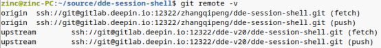
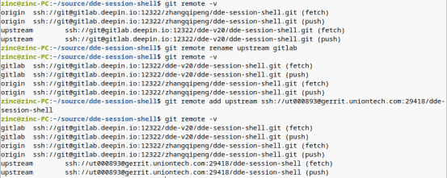
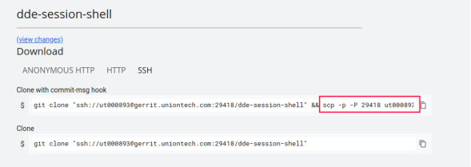
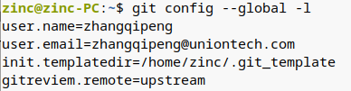

# Gerrit

- [Gitlab 仓库无缝迁移到 Gerrit 仓库](#gitlab-仓库无缝迁移到-gerrit-仓库)

## Gitlab 仓库无缝迁移到 Gerrit 仓库

以`dde-session-shell`为例，安装`sudo apt install git-review`后

- 第一步：用命令`git remote -v`查看远程仓库的地址

  

- 第二步：修改上游仓库地址为 Gerrit 远程仓库的地址

  ```bash
  git remote rename upstream gitlab # 如果没有upstream，省略这步
  git remote add upstream ssh://ut000893@gerrit.uniontech.com:29418/xxxxxx
  ```

  

- 第三步：修改配置信息

  ```bash
  mkdir -p /home/uos/.git/hooks/
  scp -p -P 29418 ut000893@gerrit.uniontech.com:hooks/commit-msg "/home/uos/.git/hooks/"
  ```

  

  ```bash
  git config --global init.templateDir /home/uos/.git_template
  # 注意这里的upstream要与第二步中的upstream匹配，可以为其它名字，一致即可
  git config --global gitreview.remote upstream
  ```

  最终配置结果如下：

  

- 第四步：提交代码

  ```bash
  git checkout uos              # 切换到需要提交代码的分支
  git commit --amend --no-edit  # 在提交的 commit 信息中添加 Change-Id
  git review uos                # 提交 gerrit review
  ```

如果还是`git review`还是失败了，将全局 hook 配置手工复制一次到代码本地库的`.git/hooks`目录下再试。

```bash
cp .git_template/hooks/* source/dde-session-shell/.git/hooks/
```
