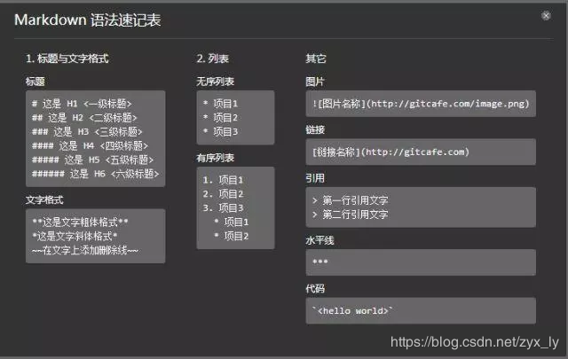

# Markdown

- [1 基本语法](#1-基本语法)
- [2 特殊语法](#2-特殊语法)
- [3 例子](#3-例子)
- [4 参考文献](#4-参考文献)

## 1 基本语法



- 标题（一级标题最多只允许有一个，最多有 6 级）

  - 第一种格式

  ```markdown
  # 这是一级标题

  ## 这是二级标题

  ### 这是三级标题

  #### 这是四级标题

  ##### 这是五级标题

  ###### 这是六级标题
  ```

  - 第二种格式

  ```markdown
  This is an H1
  =============
  This is an H2
  -------------
  ```

- 文字格式

  ```markdown
  **这是文字粗体格式**
  _这是文字斜体格式_
  ~~在文字上添加删除线~~
  ```

- 表格

  ```markdown
  | 表头   | 必须要有这一行 | “-”两边的冒号表示靠左、居中、靠右 |
  | :----- | :------------: | --------------------------------: |
  | 第一项 |     第二项     |                            第三项 |
  ```

- 列表

  - 无序列表

  ```markdown
  - 第一级 1
    - 第二级 1
      - 第三级 1
  - 第一级 2
  ```

  - 有序列表

  以下两种写法，生成的结果一样，均为第一种。

  ```markdown
  1. 项目 1
  2. 项目 2
  ```

  ```markdown
  1. 项目 1
  2. 项目 2
  ```

- 插入链接

  ```markdown
  
  [超链接](URL,"title可选")
  [章节内链接](#章节名)
  ```

- 引用

  ```markdown
  > 引用
  >
  > > 嵌套引用 1
  > >
  > > > 嵌套引用 2
  ```

- 水平线

  ```markdown
  ## +++

  ---
  ```

- 插入代码

  ```markdown
  `单行代码`
  ```

- 插入空格

  - `&nbsp;` `&#8194;` `&#xA0;`

    不换行空格，全称是 No-Break Space，它是最常见和我们使用最多的空格，大多数的人可能只接触了`&nbsp;`，它是按下 space 键产生的空格。在 HTML 中，如果你用空格键产生此空格，空格是不会累加的（只算 1 个）。要使用 html 实体表示才可累加，该空格占据宽度受字体影响明显而强烈。

  - `&ensp;` `&#8194;` `&#x2002;`

    半角空格，全称是 En Space，en 是字体排印学的计量单位，为 em 宽度的一半。根据定义，它等同于字体度的一半（如 16px 字体中就是 8px）。名义上是小写字母 n 的宽度。此空格传承空格家族一贯的特性：透明的，此空格有个相当稳健的特性，就是其占据的宽度正好是 1/2 个中文宽度，而且基本上不受字体影响。

  - `&emsp;` `&#8195;` `&#x2003;`

    全角空格，全称是 Em Space，em 是字体排印学的计量单位，相当于当前指定的点数。例如，1 em 在 16px 的字体中就是 16px。此空格也传承空格家族一贯的特性：透明的，此空格也有个相当稳健的特性，就是其占据的宽度正好是 1 个中文宽度，而且基本上不受字体影响。

  - `&thinsp;`

    窄空格，全称是 Thin Space。我们不妨称之为“瘦弱空格”，就是该空格长得比较瘦弱，身体单薄，占据的宽度比较小。它是 em 之六分之一宽。

  - `&zwnj;`

    零宽不连字，全称是 Zero Width Non Joiner，简称“ZWNJ”，是一个不打印字符，放在电子文本的两个字符之间，抑制本来会发生的连字，而是以这两个字符原本的字形来绘制。Unicode 中的零宽不连字字符映射为“”（zero width non-joiner，U+200C），HTML 字符值引用为： “‌”。

  - `&zwj;`

    零宽连字，全称是 Zero Width Joiner，简称“ZWJ”，是一个不打印字符，放在某些需要复杂排版语言（如阿拉伯语、印地语）的两个字符之间，使得这两个本不会发生连字的字符产生了连字效果。零宽连字符的 Unicode 码位是 U+200D (HTML: ‍ ‍）。

    此外，浏览器还会把以下字符当作空白进行解析：空格（ ）、制表位（ ）、换行（ ）和回车（ ）还有（　）等等。

## 2 特殊语法

- 画流程图
  - 流程图的基本类型
    - start
    - end
    - operation
    - subroutine
    - condition
    - inputoutput

  ```\flow
  ```flow
  st=>start: 创建对象
  e=>end: continue
  op1=>operation: 资源无关初始操作
  op2=>operation: 系统资源申请操作
  op3=>operation: 返回对象
  op31=>operation: 删除半成品对象
  op32=>operation: 返回NULL
  cond=>condition: 资源申请成功?
  st->op1->op2->cond
  cond(yes)->op3->e
  cond(no)->op31->op32->e
  ```

- 画时序图

  ```\sequence
  ```sequence
  title:communication
  participant main
  participant FuncA as A
  participant FuncB as B
  A-->B:
  B->main:sendmessage
  Note over A:NOTE_A
  Note right of B:NOTE_B
  ```

## 3 例子

```flow
st=>start: Start:>http://www.google.com[blank]
e=>end:>http://www.google.com
op1=>operation: My Operation
sub1=>subroutine: My Subroutine
cond=>condition: Yes or No?:>http://www.google.com
io=>inputoutput: catch something...
para=>parallel: parallel tasks
st->op1->cond
cond(yes)->io->e
cond(no)->para
para(path1, bottom)->sub1(right)->op1
para(path2, top)->op1
```

```sequence
title:communication

participant main
participant FuncA as A
participant FuncB as B

A-->B:
B->main:sendmessage
Note over A:NOTE_A
Note right of B:NOTE_B

```

```class
title:123
{
- String field
+ A()
# void method()
}
note right: 这是测试类 A
```

## 4 参考文献

- [Markdown中文文档](https://markdown-zh.readthedocs.io/en/latest/)
- [Markdown语法总结](https://www.cnblogs.com/linbudu/p/11367763.html)
- [HTML中的实体空格参考](http://www.itroad.org/2017/webui_0308/504.html)
- [Markdown中公式编辑教程](https://www.jianshu.com/p/25f0139637b7)
