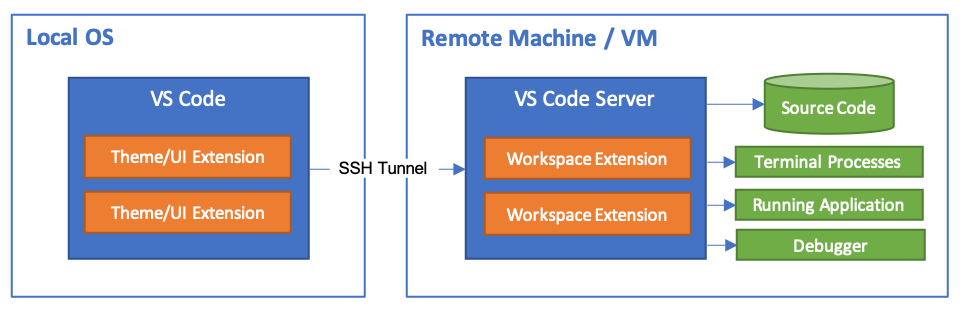
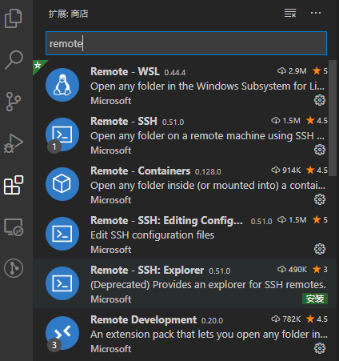
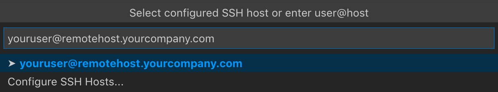
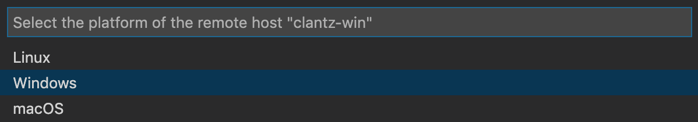
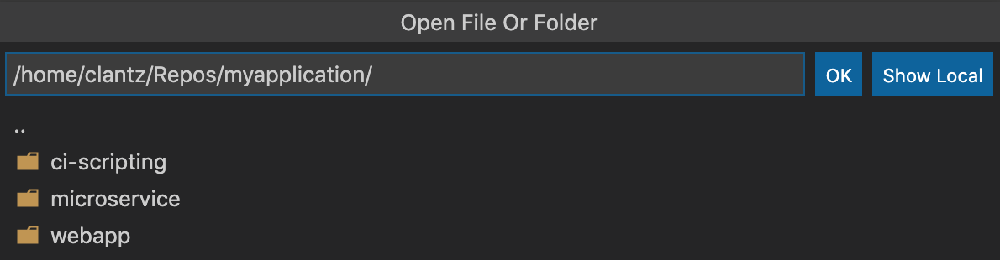
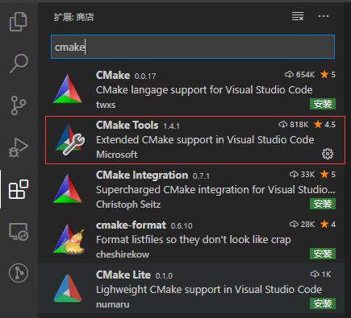
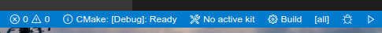

# VS Code远程开发

## 简介

Visual Studio Code通过远程开发插件可以将container，远程计算机或Windows Linux子系统（WSL）用作完整的开发环境。

## 使用SSH进行远程开发

### 入门

首先安装插件：

在VS Code中，从命令面板（F1）中选择“ Remote-SSH：Connect to Host ... ”，在窗口中运行以下命令并适当替换“ user@hostname ”来验证您可以连接到SSH主机：

如果VS Code无法自动检测到要连接的服务器的类型，就需要手动选择类型：

选择平台后，它将被存储在remote.SSH.remotePlatform属性下的VSCode设置中，因此你可以随时更改它。
稍后，VS Code将连接到SSH服务器并进行自我设置。VS Code将使用进度通知显示最新状态，并且可以在Remote-SSH输出通道中查看详细的日志。
你可以打开远程机器上的任何文件夹或工作区通过“ File > Open... or File > Open Workspace... ”，就像在本地打开一样。

### 进阶

在扩展商店里安装CMake插件后，就可以直接通过点击VSCode状态栏中的图标编译或者调试工程。
