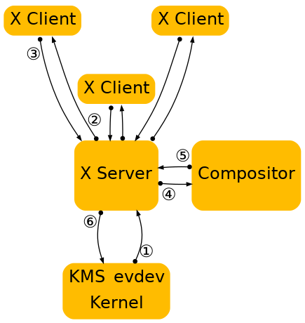
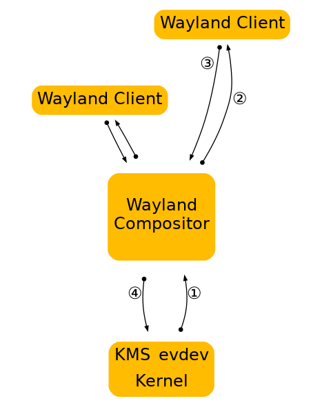
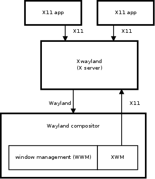

# The Wayland Protocol （译）

- [摘要](#摘要)
- [前言](#前言)
- [1 简介](#1-简介)
  - [1.1 协议的诞生](#11-协议的诞生)
  - [1.2 合成管理器作为显示服务器](#12-合成管理器作为显示服务器)
- [2 合成器的类型](#2-合成器的类型)
  - [2.1 系统合成器（System Compositor）](#21-系统合成器system-compositor)
  - [2.2 会话合成器（Session Compositor）](#22-会话合成器session-compositor)
  - [2.3 嵌入合成器（Embedding Compositor）](#23-嵌入合成器embedding-compositor)
- [3 Wayland 架构](#3-wayland-架构)
  - [3.1 X 与 Wayland 架构对比](#31-x-与-wayland-架构对比)
    - [3.1.1 X 架构](#311-x-架构)
    - [3.1.2 Wayland 架构](#312-wayland-架构)
  - [3.2 Wayland 渲染机制](#32-wayland-渲染机制)
  - [3.3 Wayland 的硬件支持](#33-wayland-的硬件支持)
- [4 Wayland 协议和运作模式](#4-wayland-协议和运作模式)
  - [4.1 基本原理](#41-基本原理)
  - [4.2 代码生成](#42-代码生成)
  - [4.3 线格式](#43-线格式)
  - [4.4 接口](#44-接口)
  - [4.5 版本控制](#45-版本控制)
  - [4.6 连接时间](#46-连接时间)
  - [4.7 安全与认证](#47-安全与认证)
  - [4.8 创建对象](#48-创建对象)
  - [4.9 Compositor](#49-compositor)
  - [4.10 界面](#410-界面)
  - [4.11 输入](#411-输入)
  - [4.12 输出](#412-输出)
  - [4.13 客户端之间的数据共享](#413-客户端之间的数据共享)
    - [4.13.1 数据协商](#4131-数据协商)
    - [4.13.2 数据设备](#4132-数据设备)
    - [4.13.3 选择](#4133-选择)
    - [4.13.4 拖放](#4134-拖放)
- [5 X11 应用程序支持](#5-x11-应用程序支持)
  - [5.1 介绍](#51-介绍)
  - [5.2 国外 Windows 的两种模式](#52-国外-windows-的两种模式)
  - [5.3 架构](#53-架构)
  - [5.4 X 窗口管理器（XWM）](#54-x-窗口管理器xwm)
  - [5.5 窗口识别](#55-窗口识别)
- [附录 A：Wayland 协议规范](#附录-awayland-协议规范)
- [附录 B：客户端接口](#附录-b客户端接口)
- [附录 C：服务器接口](#附录-c服务器接口)
- [参考文献](#参考文献)

## 摘要

Wayland 是一个提供 compositor 与其 clients 对话的协议，以及该协议的 C 语言实现。compositor 可以作为一个独立的显示服务器运行在 Linux 内核、evdev 输入设备、X 应用程序或 Wayland 客户端上。clients 可以是传统的应用程序，X 服务器（rootless or fullscreen）或其他显示服务器。

## 前言

本文档介绍了如下三个部分的内容：

1. Wayland 的架构；
2. Wayland 运作模式；
3. Wayland 的库 API。

此外，Wayland 协议规范附在附录中。本文档主要针对 Wayland 开发人员以及希望使用它进行编程的人员，不涉及应用程序开发。

该文档有很多贡献者，并且由于这只是第一版，因此可能会发现许多错误，我们感谢改正。

## 1 简介

### 1.1 协议的诞生

大多数基于 Linux 和 Unix 的系统都依赖 X 窗口系统（简称 X）作为构建位图图形接口的底层协议。在这些系统上，X 堆栈已经发展为可以包含在客户端库，帮助程序库或主机操作系统内核中的功能。对 PCI 资源管理，显示配置管理，直接渲染和内存管理等功能的支持也已集成到 X 堆栈中。但这也产生了一些局限性，例如对独立应用程序的有限支持，在其他项目中的重复使用（例如 Linux fb 层和 DirectFB 项目），以及将多个元素组合在一起的系统的高度复杂性（例如 fb 驱动程序和 X 驱动程序之间的 radeon 内存映射处理或 VT 切换）。

X 已经发展到具备了合并诸如屏幕外渲染和场景合成之类的现代特性，但其发展却也受到了 X 体系结构的限制。 例如，组合的 X 实现增加了额外的上下文切换，使输入重定向之类的事情变得困难。

上图说明了 X 服务器和合成器在操作中的核心作用，以及将内容显示在屏幕上所需的步骤。

随着时间的推移，X 开发人员逐渐认识到这种方法的缺陷，并努力将其分解。 在过去的几年中，许多功能已经从 X 服务器转移到客户端库或内核驱动程序中。在 freetype 和 fontconfig 提供的核心 X 字体的替代方案下，字体渲染是首批转移的组件之一。直接渲染 OpenGL 作为客户端库中的图形驱动程序进行了一些迭代，最终变成了 DRI2，该 DRI2 从客户端代码中抽象了大多数关于直接渲染缓冲区管理。随后，Cairo 出现并提供了一个独立于 X 的现代 2D 渲染库，并且随着 GTK +和 Qt 等工具包不再使用 X API 进行渲染，合成管理器接管了桌面的渲染控制。目前内存和显示管理已转移到 Linux 内核，进一步缩小了 X 及其驱动程序堆栈的范围。最终的理想结果是高度模块化的图形堆栈。

### 1.2 合成管理器作为显示服务器

Wayland 是一种新的显示服务器和合成协议，而 Weston 是该协议的实现，该实现建立在以上所有组件的基础上。我们正在尝试提炼出现代 Linux 桌面仍在使用的 X 服务器中的功能。结果显示并不是很多。应用程序可以使用硬件加速库（例如 libGL）或高质量软件实现（如在 Cairo 找到的那些实现）分配自己的屏幕外缓冲区并直接呈现窗口内容。 最后，我们需要的是一种可以呈现要显示的窗口，并在多个客户端之间接收和仲裁输入的方法。这就是 Wayland 通过将生态系统中已有的组件以稍微不同的方式拼合在一起而提供的一种解决方案。

与 Fortran 编译器和 VRML 浏览器的使用方式一样，X 始终是相关的，但现在是时候考虑将其移出核心组件了，作为一种可选组件兼容经典应用。

总体而言，Wayland 的理念是为客户提供一种管理窗口以及如何显示其内容的方法。渲染留给客户端，系统范围的内存管理接口用于在客户端和合成管理器之间传递缓冲区句柄。

上图说明了 Wayland 客户端如何与 Wayland 服务器进行交互。请注意，窗口管理和组合完全在服务器中处理，显着降低了复杂性，同时通过减少上下文切换略微提高了性能。 生成的系统比类似的 X 系统更易于构建和扩展，因为通常只需要在一个地方进行更改即可。在协议扩展的情况下，只有两个地方的窗口管理器或合成器需要被更新（而在 X 情况下需要更新 3 个或 4 个）。

## 2 合成器的类型

合成器的类型不同，具体取决于它们在操作系统的体系结构中所扮演的角色。 例如，系统合成器可用于引导系统，处理多用户切换，可能的控制台终端仿真器等。不同的合成器有不同的特性，如会话合成器可提供实际的桌面环境。不同类型的合成器可以通过多种方式共存。

在本节中，我们介绍三种依赖 libwayland-server 的 Wayland 合成器。

### 2.1 系统合成器（System Compositor）

系统合成器可以从启动一直运行到关机为止。它有效地替代了内核 vt 系统，并可以与系统的图形启动设置和多座支持配合使用。

系统合成器可以承载不同类型的会话合成器，并让我们在多个会话之间切换（快速用户切换或安全/个人桌面切换）。

系统合成器在 Linux 中的实现通常使用 libudev，例如 egl，kms，evdev 和 cairo。

对于全屏客户端，系统合成器可以重新编程视频扫描输出地址，直接从客户端提供的缓冲区中读取。

### 2.2 会话合成器（Session Compositor）

会话合成器负责单个用户会话。如果存在系统合成器，则会话合成器将嵌套在系统合成器下运行。嵌套是可行的，因为协议是异步的。当涉及嵌套时，往返的代价太大。如果没有系统合成器，则会话合成器可以直接在硬件上运行。

X 应用程序可以通过按需激活 root-less X 服务器的方式在会话合成器下工作。

会话合成器的可能示例包括：

- gnome-shell
- moblin
- kwin
- kmscon
- rdp session
- Weston with X11 or Wayland backend is a session compositor nested in another session compositor.
- fullscreen X session under Wayland

### 2.3 嵌入合成器（Embedding Compositor）

X11 允许客户端从其他客户端嵌入窗口，或者让客户端将其他客户端渲染的像素图内容复制到其窗口中。这种特性通常用于任务栏中的小程序，浏览器插件等。Wayland 不允许直接这样做，但是客户端可以与 GEM 缓冲区的带外数据（out-of-band，OOB）通信，例如，使用 D-Bus，或在任务栏启动小程序时使用命令行参数。另一种选择是使用嵌套的 Wayland 实例。这种情况下，Wayland 服务器必须是一个主机应用程序能链接到的库。然后主机应用程序将 Wayland 服务器套接字名称传递给嵌入式应用程序，并且需要实现 Wayland 合成器接口。主机应用程序将客户端界面作为其窗口的一部分进行组合。嵌套 Wayland 服务器的好处在于，它提供嵌入式客户端向主机通知缓冲区更新所需的请求，以及用于转发来自主机应用程序的输入事件的机制。

这种设置的一个示例是 firefox 将 Flash Player 作为专用合成器嵌入其中。

## 3 Wayland 架构

### 3.1 X 与 Wayland 架构对比

理解 Wayland 架构以及它与 X 不同的方法是追一个输入设备的事件，看最后影响屏幕显示的那一个点。

#### 3.1.1 X 架构

这是目前的 X：

1. 内核从输入设备获取一个事件，并通过 evdev 输入驱动程序将其发送到 X，内核在这一步做了很多工作，驱动设备并将不同的设备特定事件协议转换为 linux evdev 输入事件。
2. X Server 决定事件会影响那个窗口，并将事件发送到被选中等待这个事件的窗口，X Server 实际上并不知道如何执行此操作，因为屏幕上的窗口位置由 Compositor 控制，并且可以以多种方式转换为 X Server 不理解的方式（缩放，旋转，摆动，等等）。
3. 客户端监听事件，并决定该做什么。通常 UI 响应事件更改 - 或许单击一个复选框，或者指针输入必须突出显示的按钮，然后客户端将渲染请求发送回 X Server。
4. 当 X Server 接收到渲染请求时，它将其发送到驱动程序以使其驱动硬件以进行渲染，X Server 还计算渲染的边界区域，并将其作为损坏事件发送到 Compositor。
5. 损坏事件告诉 Compositor 在窗口中发生变化的内容，并且必须重新合成该窗口在屏幕中可见的一部分，Compositor 根据它的 scenegraph 以及 X Window 中的内容负责将整个窗口重新渲染。然而，它必须通过 X Server 来渲染。
6. X Server 从 Compositor 接收渲染请求，将 Compositor 后缓冲区复制到前缓冲区或者执行 PageFlip。在大多数情况下，X Server 必须执行此步骤，以便它可以解释重叠的窗口，这可能需要剪切并确定它是否可以页面翻转。但是，对于一个始终全屏的 Compositor，这是另一个不必要的上下文切换。

综上所述，这个方法有一些问题。X Server 既没有信息决定哪个窗口应接收到事件，也无法将屏幕坐标转换为本地坐标。而且即使 X 将屏幕的最终绘画责任交付给合成管理器，X 仍然控制前缓冲区和模式。X Server 需要处理的大部分复杂操作，目前都可以在内核或者自带的库中找到方法。总的来说，X Server 现在只是一个中间人，在应用程序和 Compositor 之间以及 Compositor 和硬件之间引入额外的步骤。

#### 3.1.2 Wayland 架构

在 Wayland 中，Compositor 就是 Display Server，我们将 KMS 和 evdev 的控制权交给 Compositor。Wayland 协议允许 Compositor 将输入事件直接发送给客户端，并允许客户端将损坏事件直接发送给 Compositor：

1. 内核获取一个事件并将其发送到Compositor，这与 X 类似，这很好，因为我们得以重用内核中所有的输入驱动程序。
2. Compositor 查找其 SceneGraph 以确定哪个窗口应接收该事件，SceneGraph 对应于屏幕上的内容，并且 Compositor 理解可能已经应用于 ScaleGraph 中元素的转换。因此，Compositor 可以通过应用逆变换来找到正确窗口并将其屏幕坐标转换为本地坐标。可以应用到窗口的变换种类仅限于合成器的能力，只要对于输入事件能够计算反向变换即可。
3. 与 X 一样，当客户端收到事件时，它会更新 UI 以响应。但在 Wayland 下，渲染发生在客户端中，客户端只需向 Compositor 发送请求通知更新的区域。
4. Compositor 收集来自客户端的损坏请求，然后重新合成屏幕。然后，Compositor 可以直接发出 ioctl 来安排具有 KMS 的 PageFlip。

### 3.2 Wayland 渲染机制

在上述概述中，我遗漏的一个细节是：客户端实际上是怎样在 Wayland 下渲染的。

### 3.3 Wayland 的硬件支持

参考 [[翻译]wayland 架构](https://docsin.uniontech.com/?p=8280)

## 4 Wayland 协议和运作模式

### 4.1 基本原理

Wayland 协议是一种异步的面向对象的协议。所有请求都是对某个对象的方法调用。每个请求包括一个对象 ID，该 ID 唯一标识服务器上的一个对象。 每个对象都实现一个接口，并且请求种包含一个操作码，该操作码标识接口中要调用的方法。

该协议是基于消息的。客户端发送到服务器的消息称为请求。从服务器到客户端的消息称为事件。一条消息有许多参数，每个参数都有特定的类型（有关参数类型的列表，请参见[Wire Format](#43-线格式)）。

此外，协议可以指定名称与特定数字枚举值相关联的枚举。这些本质上仅是描述性的：在有线格式级别的情况下，枚举只是整数。但是它们还具有次要的目的，增强类型的安全性，在语言绑定上添加上下文联系等。仅在引入这些属性之前编写的代码在此之后仍然有效时，才支持后一种用法。换句话说，添加枚举不应破坏 API，否则会向后兼容。

枚举可以定义为一组整数，也可以定义为位域。这是通过枚举定义中的 bitfield 布尔值属性指定的。如果此属性为 true，则打算主要使用按位运算来访问该枚举，例如，当任意多个枚举可以一起进行“或”运算时； 如果为假，或者省略了属性，则枚举参数只是一系列数值。

enum 属性可用于 uint 或 int 参数，但是，如果将 enum 定义为位域，则只能在 uint args 上使用。

服务器将事件发送回客户端，每个事件都是从一个对象发出的。事件可能是错误条件。事件包括对象 ID 和事件操作码，客户端可以从中确定事件的类型。 事件是响应请求（在这种情况下，请求和事件构成往返）而生成的，或者是在服务器状态更改时自发生成的。

在连接上时广播状态，状态更改时发出事件。客户端必须侦听这些变化并缓存状态。不需要查询服务器状态。

服务器将广播许多全局对象的存在，而这些对象又将广播其当前状态。

### 4.2 代码生成

接口、请求和事件在 protocol/wayland.xml 中定义。此 xml 用于生成可由客户端和合成器使用的功能原型。

协议入口点是作为内联函数生成的，它们仅包装`wl_proxy\_ \*`函数。内联函数不是库 ABI 的一部分，语言绑定应为 xml 中的协议入口点生成自己的存根。

### 4.3 线格式

该协议通过 UNIX 域流套接字发送，该端点通常被命名为 wayland-0（尽管可以在环境中通过 WAYLAND_DISPLAY 进行更改）。从 Wayland 1.15 开始，通过将 WAYLAND_DISPLAY 设置为服务器端点侦听的绝对路径，实现可以有选择地支持位于文件系统中任意位置的服务器套接字端点。

每个消息的结构都是 32 位字。值以主机的字节顺序表示。消息头部包含 2 个字：

- 第一个字是发送者的对象 ID（32 位）。
- 第二个具有 2 部分的 16 位。高 16 位是消息大小，以字节为单位，从标头开始（即最小值为 8），低位是请求/事件操作码。

有效负载描述了请求/事件参数。每个参数始终与 32 位对齐。需要填充的地方，填充字节的值是不确定的。没有描述类型的前缀，但是可以从 xml 规范中隐式地推断出来。

参数类型的表示如下：

- `int`, `uint`: 该值是有符号/无符号 int 的 32 位值。
- `fixed`: 签名 24.8 个十进制数字。它是带符号的十进制类型，提供一个符号位，23 位的整数精度和 8 位的十进制精度。在 C API 方面，这是不透明的结构，带有转换辅助函数，往返于 double 和 int 之间。
- `string`: 以无符号的 32 位长度开始，然后是字符串内容，包括终止空字节，然后填充到 32 位边界。
- `object`: 32 位对象 ID。
- `new_id`: 32 位对象 ID。 根据请求，客户端确定 ID。带有 new_id 的唯一事件是全局变量的通告，并且服务器将使用 0x10000 以下的 ID。
- `array`: 以 32 位数组大小（以字节为单位）开始，然后逐字逐行排列数组内容，最后填充到 32 位边界。
- `fd`: 文件描述符不是存储在消息缓冲区中，而是存储在 UNIX 域套接字消息（msg_control）的辅助数据中。

### 4.4 接口

该协议包括用于与服务器交互的几个接口。 每个接口都如上所述提供请求，事件和错误（实际上只是特殊事件）。 特定的合成器实现可能具有作为扩展提供的自己的接口，但是总是希望有几种接口。

核心接口：

- `wl_display`: 核心全局对象
- `wl_registry`: 全局注册表对象
- `wl_callback`: 回调对象
- `wl_compositor`: 合成器单例
- `wl_shm_pool`: 共享内存池
- `wl_shm`: 共享内存支持
- `wl_buffer`: `wl_surface` 的内容
- `wl_data_offer`: 提供传输数据
- `wl_data_source`: 提供传输数据
- `wl_data_device`: 数据传输装置
- `wl_data_device_manager` 数据传输接口
- `wl_shell`: 创建桌面样式的表面
- `wl_shell_surface`: 桌面式元数据界面
- `wl_surface`: 屏幕上的表面
- `wl_seat`: 输入设备组
- `wl_pointer`: 指针输入设备
- `wl_keyboard`: 键盘输入设备
- `wl_touch`: 触摸屏输入设备
- `wl_output`: 合成器输出区域
- `wl_region`: 区域界面
- `wl_subcompositor`: 次表面的合成器
- `wl_subsurface`: `wl_surface` 的次表面接口

### 4.5 版本控制

每个接口都有版本，每个协议对象都实现其接口的特定版本。对于全局对象，将使用全局变量通告服务器支持的最大版本，并且创建的协议对象的实际版本由传递给 wl_registry.bind()的 version 参数确定。对于不是全局对象的对象，将从创建它们的对象中推断出它们的版本。

为了保持合理，这对接口版本有一些影响：

1. 对象创建层次结构必须是一棵树。 否则，从父对象推断对象版本将变得更加难以正确跟踪。
2. 接口的版本增加时，其父版本也会增加（递归直到到达全局接口）
3. 全局接口的版本号充当其所有子接口的计数器。 每当修改子接口时，全局父接口的版本号也会增加（请参见上文）。 然后，子接口与其父全局接口的新版本具有相同的版本号。

为了说明上述内容，请考虑 wl_compositor 接口。它有两个子类，wl_surface 和 wl_region。从 Wayland 版本 1.2 开始，wl_surface 和 wl_compositor 均为版本 3。如果在 wl_region 接口中添加了某些内容，则 wl_region 和 wl_compositor 都将变为版本 4。如果之后更改 wl_surface，则 wl_compositor 和 wl_surface 都将位于 版本 5。这样，全局接口版本就可以用作其所有子接口的“计数器”。 在给定其父代版本的情况下，这非常容易知道子代的版本。 子级的接口版本最高，小于或等于其父级的版本。

值得注意的是上述版本控制方案的特定例外。 wl_display（以及扩展名 wl_registry）接口不能更改，因为它是核心协议对象，并且其版本从不发布，也没有机制来请求其他版本。

### 4.6 连接时间

没有固定的连接设置信息，服务器在连接时发出多个事件，以指示全局对象的存在和属性：输出，合成器，输入设备。

### 4.7 安全与认证

主要涉及对基础缓冲区的访问，是否需要新的 drm auth 机制（gift-to ioctl 想法），需要检查 cmd 流？

通过 fd 传递会话 dbus，获取服务器套接字取决于合成器类型，可能是系统范围的名称。 或客户端由合成器分叉并且 fd 已打开。

### 4.8 创建对象

每个对象都有一个唯一的 ID。这些 ID 由创建对象的实体（客户端或服务器）分配。 客户端分配的 ID 的范围为[1，0xfeffffff]，而服务器分配的 ID 的范围为[0xff000000，0xffffffff]。保留 0 ID 以表示空或不存在的对象。为了提高效率，在不使用 ID N 的情况下，要密集使用 ID，直到使用 N-1。任何不保留此属性的 ID 分配算法都与 libwayland 中的实现不兼容。

### 4.9 Compositor

合成器是一个全局对象，在连接时发布。

有关协议说明，请参见 wl_compositor - the compositor singleton。

### 4.10 界面

表面管理着客户端创建的用于在屏幕上显示其内容的像素的矩形网格。 客户不知道其表面的全局位置，也无法访问其他客户的表面。

客户端完成像素写入后，将&quot;提交&quot;缓冲区。 这允许合成器访问缓冲区并读取像素。 合成器完成后，它将缓冲区释放回客户端。

有关协议说明，请参见&quot;wl_surface - an onscreen surface&quot;一节。

### 4.11 输入

座位代表一组输入设备，包括鼠标，键盘和触摸屏。它具有键盘和指针焦点。座位是全局对象。指针事件以表面局部坐标传递。

按下按钮时，合成器将保持隐式抓取，以确保将相应的按钮释放事件传递到同一表面。但是客户无法采取任何明确的措施。取而代之的是，可以将表面映射为&quot;弹出窗口&quot;，将瞬态窗口语义与指针抓取结合在一起。

为避免竞争状况，可能触发更多请求的输入事件（例如按钮按下，键事件，指针运动）都带有序列号，而诸如 wl_surface.set_popup 之类的请求则要求指定触发事件的序列号。服务器为这些序列号维护一个单调递增的计数器。

输入事件还带有毫秒级的时间戳。它们的基数是不确定的，因此无法将它们与系统时间（通过 clock_gettime 或 gettimeofday 获得）进行比较。但是，它们可以相互比较，例如，可以将按钮的按下顺序识别为双击还是三次。

有关协议说明，请参见&quot;wl_seat - group of input devices&quot;一节。

涉及：

1. 键盘图，更改事件
2. Wayland 上的 xkb
3. 多指针 Wayland

当表面是输入设备的指针焦点时，表面可以更改指针图像。当指针进入表面时，Wayland 不会自动更改指针图像，但希望应用程序响应指针的焦点和运动事件来设置所需的指针。基本原理是，无论如何，客户端都必须响应运动事件来管理表面中 UI 元素的更改指针图像，因此我们将使它成为设置或更改指针图像的唯一机制。如果在表面失去指针焦点之后服务器收到设置指针图像的请求，则该请求将被忽略。对于客户端，这看起来像它成功设置了指针图像。

当没有表面针对该设备的指针焦点时，合成器会将指针图像还原为默认图像。客户端可以通过设置 NULL 图像将指针图像恢复为默认图像。

如果指针从已设置特殊指针图像的一个窗口移动到没有响应运动事件而未设置图像的表面，该怎么办？新表面将被特殊指针图像卡住。我们不能仅在离开表面时还原指针图像，因为如果立即进入设置不同图像的表面，图像将闪烁。我想应用程序坏了。

### 4.12 输出

输出是一个全局对象，它在连接时或在连接时进行通告。

有关协议说明，请参见&quot;wl_output - compositor output region&quot;一节。

1. 布置在一个大（合成）坐标系中
2. 基本上是基于 Wayland 的 xrandr
3. 几何需要在合成器坐标系中的位置
4. 发布可用模式的事件，移动和更改模式的请求

### 4.13 客户端之间的数据共享

Wayland 协议为客户端提供了一种共享数据的机制，该机制允许执行复制粘贴和拖放操作。提供数据的客户端将创建 wl_data_source 对象，获得数据的客户端会将其视为 wl_data_offer 对象。该接口允许客户端就相互支持的 mime 类型达成协议，并通过通过协议传递的文件描述符传输数据。

下一节将说明数据源与数据提供对象之间的协商。名为&quot;数据设备&quot;的部分说明了如何使用实现复制粘贴和拖放支持的 wl_data_device 接口创建这些对象并将其传递给不同的客户端。

有关协议的说明，请参见&quot;wl_data_offer - offer to transfer data&quot;一节，&quot;wl_data_source - offer to transfer data&quot;一节，&quot;wl_data_device - data transfer device&quot;一节和&quot;wl_data_device_manager - data transfer interface&quot;一节。

MIME 在 RFC 2045-2049 中定义。 MIME 类型的注册表由 Internet 号码分配机构（IANA）维护。

#### 4.13.1 数据协商

向其他客户端提供数据的客户端将创建 wl_data_source 对象，并通过 wl_data_source.offer 请求为其支持的数据格式播报 mime 类型。在接收端，数据提供对象将为每种支持的 mime 类型生成一个 wl_data_offer.offer 事件。

实际的数据传输发生在接收客户端发送 wl_data_offer.receive 请求时。该请求将一个 mime 类型和一个文件描述符作为参数。该请求将在发送客户端上使用相同的参数生成一个 wl_data_source.send 事件，并且期望后者使用所选的 mime 类型将其数据写入给定的文件描述符。

#### 4.13.2 数据设备

数据设备将数据源和提供的内容粘合在一起。 数据设备与 wl_seat 关联，并且由客户端使用 wl_data_device_manager 工厂对象获得，该对象也负责创建数据源。

通过 wl_data_device.data_offer 事件通知客户新的数据提供。 生成此事件后，数据商品将通告可用的 mime 类型。 在将新数据商品用于复制粘贴或拖放操作之前，先对其进行介绍。

#### 4.13.3 选择

每个数据设备都有一个选择数据源。客户端使用设备管理器创建数据源对象，并将其设置为给定数据设备的当前选择。每当当前选择更改时，具有键盘焦点的客户端都会收到 wl_data_device.selection 事件。 该事件也将在客户端获得键盘焦点之前立即在客户端上生成。

数据提供在选择事件之前通过 wl_data_device.data_offer 事件引入。

#### 4.13.4 拖放

使用 wl_data_device.start_drag 请求开始拖放操作。此请求将导致一个指针获取，该获取将在数据设备上生成输入，移动和离开事件。数据源作为 start_drag 的参数提供，并且与之关联的数据提供在 wl_data_device.enter 事件中的指针下方提供给客户端表面。在输入事件之前将数据提供与 wl_data_device.data_offer 事件一起介绍给客户端。

希望客户端通过使用其接受的 mime 类型调用 wl_data_offer.accept 请求来向数据发送客户端提供反馈。如果接收方客户端不支持任何广告的 mime 类型，则应为接受请求提供 NULL。接受请求使发送方客户端接收到具有所选 mime 类型的 wl_data_source.target 事件。

拖动结束后，接收客户端将收到 wl_data_device.drop 事件，预计该事件将使用 wl_data_offer.receive 请求传输数据。

## 5 X11 应用程序支持

### 5.1 介绍

能够运行现有的 X11 应用程序对于采用 Wayland 至关重要，尤其是在台式机上，因为始终会有尚未或无法转换为 Wayland 应用程序的 X11 应用程序，而将它们全部丢弃将是令人望而却步的。因此，Wayland 合成器通常需要支持运行 X11 应用程序。

X11 和 Wayland 的区别足够大，以至于它们之间没有&quot;简单&quot;的翻译方式。对于 Wayland 合成器，大多数 X11 都不感兴趣。这与支持 X11 所需的巨大实现工作相结合，使得仅直接在 Wayland 合成器中编写 X11 支持变得很困难。实现将是真正的 X11 服务器。

因此，Wayland 合成器应该使用 Xwayland，它是 Xorg 服务器，它位于 Xorg 服务器源代码存储库中，并且与 Xorg 服务器共享大多数实现。与 Xorg 一样，Xwayland 是一个完整的 X11 服务器，但是它不是驱动显示器和打开输入设备，而是充当 Wayland 客户端。本章的其余部分讨论 Xwayland 如何工作。

出于集成和体系结构的原因，Xwayland 是 Wayland 合成器的 Wayland 客户，而 Wayland 合成器是 Xwayland 的 X11 客户。这种循环依赖关系需要 Wayland 合成器特别注意。

### 5.2 国外 Windows 的两种模式

通常，可以用以下两种方式之一来显示来自外部窗口系统的窗口：无根和有根（不是无根）。

在有根模式下，外部窗口系统总体上表示为其自身的窗口（或更多）。您有一个本机窗口，所有外部窗口都在其中。在 Xwayland 的情况下，这种方法的优点是您可以运行自己喜欢的 X11 窗口管理器来管理 X11 应用程序。缺点是外部窗口无法与本机桌面集成。因此，通常不使用此模式。

在无根模式下，每个外部窗口都是本机窗口中的第一类居民。外部窗口不限于本机窗口，而是充当本机窗口。优点是可以自由堆叠和混合本机窗口和外部窗口，这在 root 模式下是不可能的。缺点是此模式难以实现，并且窗口系统的根本差异可能会阻止某些操作。使用无根 Xwayland，Wayland 合成器必须担当 X11 窗口管理器的角色，并且不能在其位置使用任何其他 X11 窗口管理器。

本章重点介绍无根模式，而忽略无根模式。

### 5.3 架构

Wayland 合成器通常负责启动 Xwayland。 Xwayland 与 Wayland 合成器合作如下：

X11 应用程序连接到 Xwayland 就像连接到任何 X 服务器一样。 Xwayland 处理所有 X11 请求。另一方面，Xwayland 是 Wayland 客户，它连接到 Wayland 合成器。

X11 窗口管理器（XWM）是 Wayland 合成器的组成部分。 XWM 使用通常的 X11 窗口管理协议来管理 Xwayland 中的所有 X11 窗口。最重要的是，XWM 充当 Xwayland 窗口状态与 Wayland 合成器的窗口管理器（WWM）之间的桥梁。这样，WWM 可以管理所有窗口，包括本地 Wayland 和 X11（Xwayland）窗口。这对于连贯的用户体验非常重要。

由于 Xwayland 使用 Wayland 进行输入和输出，因此 Xorg 使用的设备驱动程序没有任何用处。没有使用 xf86-video- \*或 xf86-input- \*模块。 Xwayland 服务器也没有配置文件。对于可选的硬件加速渲染，Xwayland 使用 GLAMOR。

Wayland 合成器通常仅产生一个 Xwayland 实例。这是因为许多 X11 应用程序假定它们可以通过 X 服务器与其他 X11 应用程序进行通信，并且这需要共享的 X 服务器实例。这也意味着 Xwayland 不会保护或隔离 X11 客户端，除非 Wayland 合成器专门选择通过生成特定于应用程序的 Xwayland 实例来中断 X11 客户端的互通。 X11 客户端与 Wayland 客户端自然隔离。

与本地 X 服务器相比，Xwayland 兼容性可能永远不会达到 100％。几乎不支持桌面环境（DE）组件，尤其是 X11 窗口管理器。 X11 窗口管理器不会知道本机的 Wayland 窗口，因此它只能管理 X11 窗口。另一方面，必须有一个 XWM 保留专用的窗口管理器角色，以便 Wayland 合成器可以正确显示 X11 窗口。对于其他 DE 组件，例如寻呼机和面板，通常认为添加必要的接口以通过 XWM 在 WWM 中支持它们是不值得的。

### 5.4 X 窗口管理器（XWM）

从 X11 的角度来看，位于 Wayland 合成器中的 X 窗口管理器（XWM）与其他任何窗口管理器一样。 区别主要在于它驻留在哪个进程中，以及 X11 协议中的一些额外约定专门支持 Wayland 窗口管理（WWM）。

Xwayland 和 Wayland 合成器之间有两个独立的异步通信通道：一个使用 Wayland 协议，另一个仅用于 XWM，使用 X11 协议。此设置需要 XWM 实施非常注意，以避免与 Xwayland 发生（随机）死锁。通常几乎不可能证明来自 XWM 的同步或阻塞 X11 调用不会导致死锁，因此强烈建议使所有 X11 通信异步。Wayland 的所有通信在设计上就已经不同步了。

### 5.5 窗口识别

在 Xwayland 中，X11 窗口在 Wayland 中可能具有相应的 wl_surface 对象。 wl_surface 对象用于输入和输出：它由输入事件引用，并用于向 Wayland 合成器提供 X11 窗口内容。X11 窗口和 wl_surface 存在于不同的协议流中，因此 XWM 需要对其进行匹配才能完成其工作。

当 Xwayland 在 Wayland 上创建 wl_surface 时，还将向 X11 窗口发送原子类型为 WL_SURFACE_ID 的 X11 ClientMessage，该窗口将 wl_surface Wayland 对象 ID 作为第一个 32 位数据元素。这就是 XWM 如何将 wl_surface 与 X11 窗口关联的方式。请注意，创建 wl_surface 和 ID 消息的请求可以以任何顺序到达 Wayland 合成器。

## 附录 A：Wayland 协议规范

[Wayland Protocol Specification](wayland-protocol-specification.md)

## 附录 B：客户端接口

待完善。。。

## 附录 C：服务器接口

待完善。。。

## 参考文献

- [Wayland](https://wayland.freedesktop.org/docs/html/).
