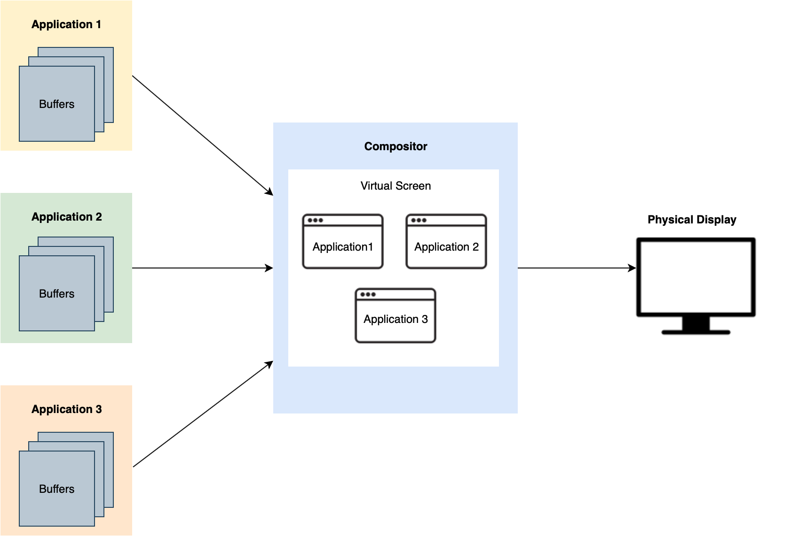
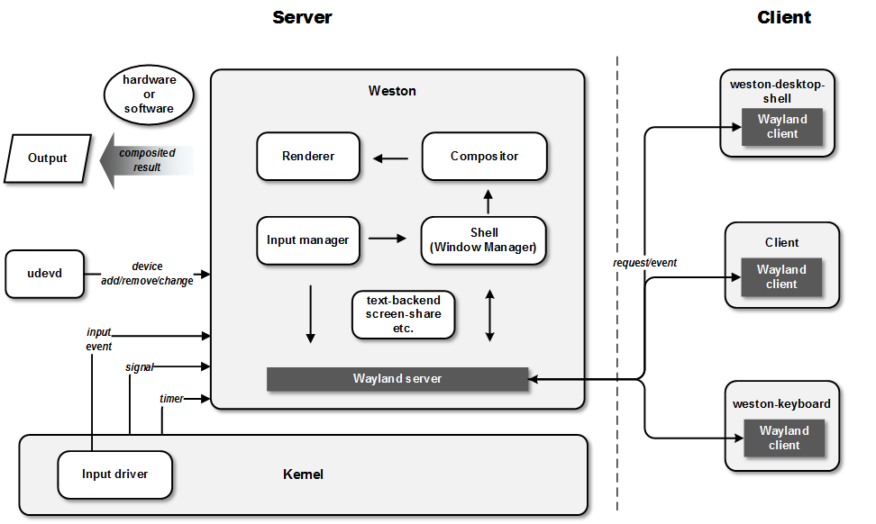
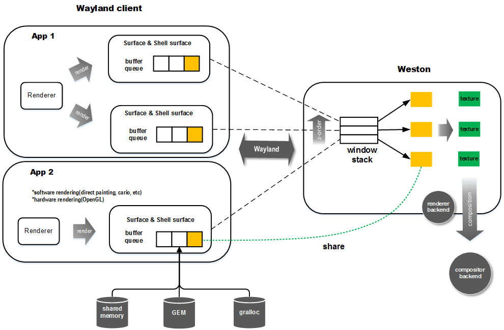
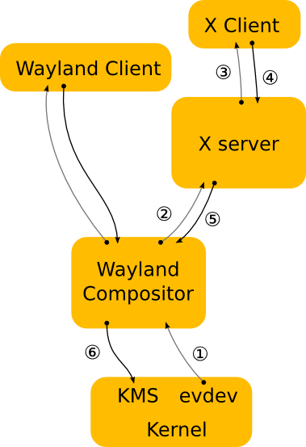

# Wayland

- [Wayland 和 Qt](#wayland-和-qt)
- [Wayland 架构](#wayland-架构)
- [渲染流程](#渲染流程)
- [输入管理](#输入管理)
- [Wayland 与 KWayland](#wayland-与-kwayland)
- [Wayland 与 XWayland](#wayland-与-xwayland)
- [总结](#总结)

## Wayland 和 Qt

QtWayland 是封装了 Wayland 功能的 Qt5 模块，QtWayland 被分为一个客户端(client)和一个服务端(server)。客户端是 wayland 平台插件，提供了运行 Wayland 客户端 Qt 程序的方法。服务端是 QtCompositor 应用程序接口(API)，允许用户编写自己的 compositors。在 Wayland 中，每一个程序窗口相当于一个 client，在收到 compsitor 的窗口变化通知以后，通过直接渲染机制，绘制自己的窗口，当绘制完成，将数据存在 buffer 中，通知 compsitor 某一块区域更新了，compositor 以一定的采样周期，收集那些应用程序 buffer 中的数据，将各个窗口的改动合成，通过调用 OpenGL ES 渲染出来。

## Wayland 架构

Wayland 从架构上来看，大致由 Compsoitor 和 Client 两部分组成，关于 Compositor 的实现有很多种，官方给了一个参考实现，名字叫 Weston，另一个非官方的有 kde 的 kwin，这两个的关系就像显卡里的公版卡和非公版卡的区别。Weston 从内部体系结构来看，主要分为窗口管理(shell），合成器（compositor）和输入管理几个部分。从大体的流程上来看，输入管理模块接受用户输入，然后一方面 shell 作出相应的窗口管理操作（如窗口堆栈的改变，focus 的变化等），另一方面将该 input event 传给之前注册了相应输入事件的 client。client 收到后会做相应动作，如调整视图然后重绘。如有重绘发生，新 buffer 渲染完成后 client 将通知 server，接着 server 端生成 z-order 序的窗口列表，之后 compositor 用 renderer 进行合成，最后输出。

## 渲染流程

一个 Wayland client 要将内存渲染到屏幕上，首先需要申请一个 graphic buffer，绘制完后传给 Wayland compositor 并通知其重绘。Wayland compositor 收集所有 Wayland client 的请求，然后以一定周期把所有提交的 graphic buffer 进行合成。合成完后进行输出。本质上，client 需要将窗口内容绘制到一个和 compositor 共享的 buffer 上。理论上，client 可以始终只用一块 buffer，但因为这块 buffer 在 client 和 server 同时访问会产生竞争，所以一般 client 端都会实现 buffer queue。在这条流水线上，可以看到，client 和 server 端都会发生绘制。client 绘制本地的窗口内容，server 端主要用于合成时渲染。注意两边都可独立选择用软件或者硬件渲染。

## 输入管理

为了提高输入管理部分的重用性和模块性。Weston 将对输入设备（键盘，鼠标，触摸屏等）的处理分离到一个单独的库，也就是 libinput 中。这样，其它的图形处理系统也可以共用这部分，比如 Xorg
Server 和 Mir。具体地，它提供了设备检测，设备处理，输入事件处理等基本功能。

libinput 更像是一个框架，它将几个更底层的库的功能整合起来。它主要依赖于以下几个库：

• mtdev：Multi-touch 设备处理。

• libevdev：处理 kernel 中 evdev 模块对接。

• libudev：主要用于和 udevd 的通信，从而获取设备的增加删除事件。

Weston 中的输入管理模块与 libinput 对接，它实现了两大部分的功能：一是对输入设备的维护，二是对输入事件的处理。

## Wayland 与 KWayland

KWin 可以当作是 Wayland 的 Client，Wayland 库具有不错的回调机制，但是对于 Qt 开发人员来说不是很方便，例如，Qt 开发人员更喜欢发出信号而不是调用静态回调，为了不重复工作或在多个项目中使用类似的 API，从 KWin 中分离出代码并将其转换为自己的库，结果就是 KWayland。

## Wayland 与 XWayland

Wayland 本身就是一个完整的窗口系统，但是即使如此，如果要从 X 迁移过来，能够向后兼容是很有必要的。在经过一些更改后，即可将 Xorg 服务器修改为使用 Wayland 输入设备进行输入，并将根窗口或各个顶层窗口作为 Wayland 窗口。X 服务器仍然运行与本机运行时相同的 2D 驱动程序，并具有相同的加速代码。主要区别在于，wayland 负责处理窗口的显示，而不是 KMS。

## 总结

在 Xorg 中，X Server 相当于一个大家长，其他模块的操作都得先问它，经过它的批准才能执行，X Server 本身的工作是比较少的，并且随着 X Window 的快速演化，相当多的操作从 X Server 转移到了其它的模块中，新的功能都是通过扩展的模式实现的。这也就是 1987 年的 X11 协议到如今还能适应现代桌面的需求的原因。X 将“提供机制，而非策略”的哲学贯彻的非常彻底。

X Window 在核心层之外提供了一个扩展层，开发者可以开发相应的扩展来实现的扩展协议，从而适应时代的变化产生的新的需求。但随着需求的增长，X Window 的缺点也慢慢暴露出来。因为所有的操作都需要经过 X Server 检查一遍，即便是合成器已经判断过没有问题的渲染也需要请求 X Server，在 X Server 又判断一遍没问题后，才让合成器执行内容合成与渲染操作，这其中 X Server 的判断操作就产生了重复操作，带来了效率问题。
相比之下，Wayland 的流程就简化了许多，合成器和客户端各司其职，各自负责各自的内容。客户端负责更新自己的窗口，合成并渲染自己的窗口，合成器负责将各个客户端的窗口合成一个大的显示器窗口展示给用户。从本质上来说，客户端和合成器工作的内容大致相同，少了一些重复的操作。

即便如此 Wayland 也有自己的缺点，那就是还不够成熟，它需要一个契机，一个 X Window 退居幕后的契机，将 Wayland 推上舞台。目前来看，在游戏领域，Wayland 的效率是它的优势，毕竟 X Window 的画面撕裂是用户所不能忍受的。相信随着 Linux 操作系统的普及，Wayland 终会找到属于它的时代。
